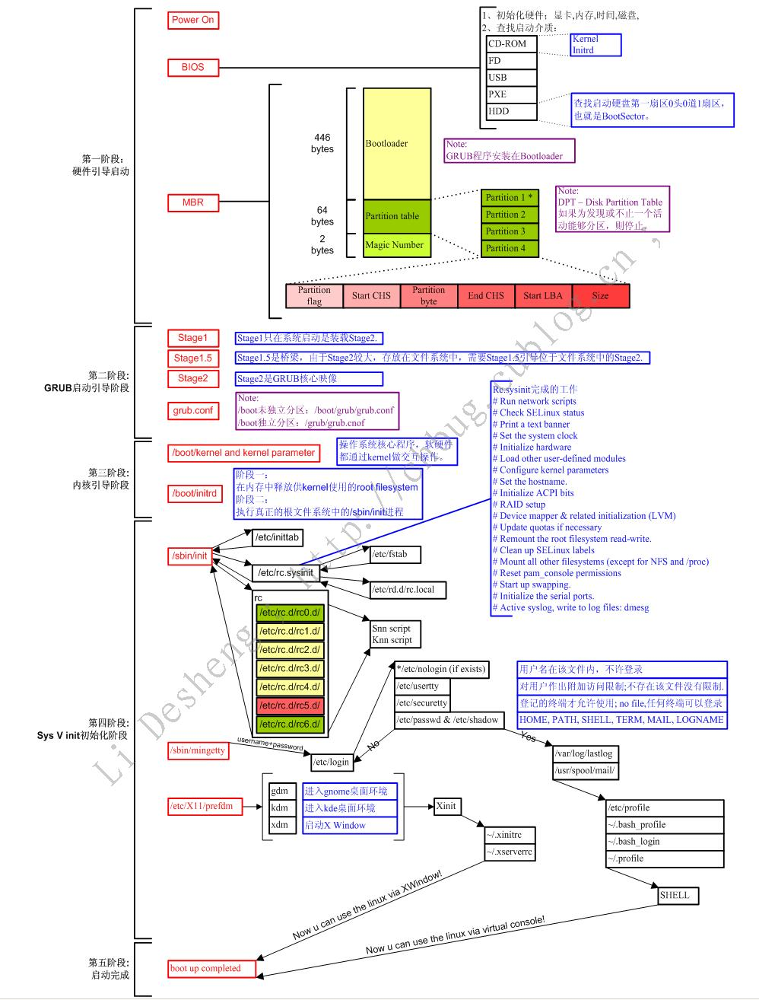
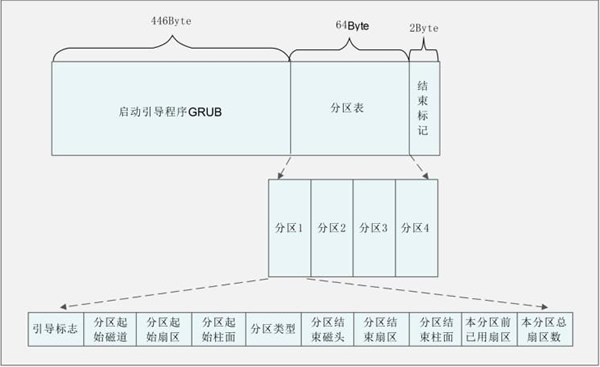
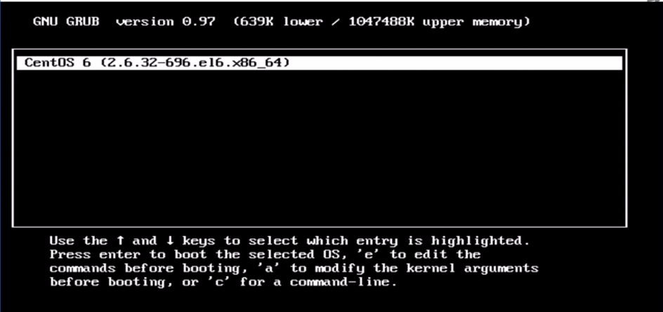

# Linux系统启动
## 启动方式
+ BIOS + MBR + GRUB
+ 当然，还有其他的搭配方式
## 整体流程

## 启动流程详解
1. POST(Power-on self test) 加电自检
   + 主要负责检测系统外围关键设备（如：CPU、内存、显卡、I/O、键盘鼠标等）是否正常
2. 系统引导 -> MBR(Master Boot Record) -> GRUB(GRand Unified Bootloader)
   + MBR[链接](https://zh.wikipedia.org/wiki/%E4%B8%BB%E5%BC%95%E5%AF%BC%E8%AE%B0%E5%BD%95 "MBR")
     - 
     - MBR(Master Boot Record)，主引导记录，MBR存储于磁盘的头部，大小为512bytes，其中，446bytes用于存储BootLoader程序，64bytes用于存储分区表信息，最后2bytes用于MBR的有效性检查
        + 446bytes:主引导记录最开头是第一阶段引导代码。其中的硬盘引导程序的主要作用是检查分区表是否正确并且在系统硬件完成自检以后**将控制权交给硬盘上的引导程序（如GNU GRUB）**。它不依赖任何操作系统，而且启动代码也是可以改变的，从而能够实现多系统引导。
        + 64bytes:硬盘分区表占据主引导扇区的64个字节（偏移01BEH--偏移01FDH），可以对四个分区的信息进行描述，其中每个分区的信息占据16个字节。具体每个字节的定义可以参见硬盘分区结构信息
        + 2bytes:结束标志字55，AA（偏移1FEH－偏移1FFH）最后两个字节，是检验主引导记录是否有效的标志。
     - 主引导记录和硬盘分区
        + 从主引导记录的结构可以知道，它仅仅包含一个64个字节的硬盘分区表。由于每个分区信息需要16个字节，所以对于采用MBR型分区结构的硬盘，最多只能识别4个主要分区（Primary partition）。所以对于一个采用此种分区结构的硬盘来说，想要得到4个以上的主要分区是不可能的。这里就需要引出扩展分区了。**扩展分区也是主要分区的一种**，但它与主分区的不同在于理论上可以划分为无数个逻辑分区
        + 扩展分区中逻辑驱动器的引导记录是链式的。每一个逻辑分区都有一个和MBR结构类似的扩展引导记录（EBR），其分区表的第一项指向该逻辑分区本身的引导扇区，第二项指向下一个逻辑驱动器的EBR，分区表第三、第四项没有用到。Windows系统默认情况下，一般都是只划分一个主分区给系统，剩余的部分全部划入扩展分区。这里有下面几点需要注意： 
            1. 在MBR分区表中最多4个主分区或者3个主分区＋1个扩展分区，也就是说扩展分区只能有一个，然后可以再细分为多个逻辑分区。(拓展分区占了一个主分区名额)
            2. 在Linux系统中，硬盘分区命名为sda1－sda4或者hda1－hda4（其中a表示硬盘编号可能是a、b、c等等）。在MBR硬盘中，分区号1－4是主分区（或者扩展分区），逻辑分区号只能从5开始。
            3. 在MBR分区表中，一个分区最大的容量为2T，且每个分区的起始柱面必须在这个disk的前2T内。你有一个3T的硬盘，根据要求你至少要把它划分为2个分区，且最后一个分区的起始扇区要位于硬盘的前2T空间内。如果硬盘太大则必须改用GPT。
   + GRUB[链接](https://zh.wikipedia.org/wiki/GNU_GRUB "GRUB")
     - 多操作系统引导程序。GRUB是多启动规范的实现，它允许用户可以在计算机内同时拥有多个操作系统，并在计算机启动时选择希望运行的操作系统。GRUB可用于选择操作系统分区上的不同内核，也可用于向这些内核传递启动参数
     - 启动过程
       + 计算机启动后，BIOS将寻找第一个可启动的设备（通常为硬盘），而后从MBR中加载启动程序，然后把控制交给这段代码。MBR位于硬盘的前512字节内。
     - GRUB采用滚动屏幕选择想要启动的操作系统。通过向"menu.lst"（或grub.cfg）文件中添加相关信息，GRUB可以控制150或者更多的启动选项，在启动时用方向键进行选择。(安装多系统时，选择要启动的操作系统)
     - grub.conf文件(pics下)，这是安装Ubuntu&windows10双系统的grub文件，搜索windows可以搜索出windows10启动项
     - 当GRUB启动后
       + 一旦选择了启动选项，GRUB把选择的内核加载内存并把控制交给内核。在此步骤中，对于Windows之类不支持多启动标准的操作系统，**GRUB也可以通过链式启动把控制传给其它启动器**。在这种情况下，其它操作系统的启动程序被GRUB保存了下来；与内核不同，其它操作系统如同直接自MBR启动。类似Windows的启动菜单，也许是另一个启动管理器，它允许在多个不支持多启动的操作系统中做进一步的选择。（在已有Windows的系统上面，或者包含多个Windows版本的系统上安装现代的Linux而不修改原操作系统，即属于这类情况(安装多系统)。）
           - 通过链式启动，一个启动器可以启动另一个启动器。GRUB通过2到3行的命令就可以从DOS、Windows、Linux、BSD和Solaris系统启动。
     - 即，我们可以在多个分区安装Bootloader,每个引导加载程序对应不同的操作系统，将这些均交由GRUB去管理，这就是多操作系统的实现原理
     - 若我们的计算机上存在多个内核，那么就会出现如下界面来选择需要启动的内核
       + 
3. 启动init进程
   + /etc/inittab  运行级别
   + /etc/rc.d/rc.sysint  即init会运行一系列的脚本
4. 模块加载
   + 加载 iptable 模块
   + ...
5. 运行级别
   + 运行 /etc/rcX.d/.... 下的脚本
6. 用户启动
   + /etc/rc.local
7. login
   + 之后就可以进入用户登录界面了。至此，系统启动完成