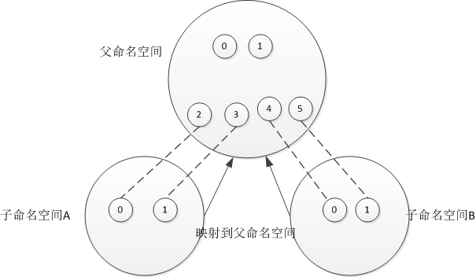

# Linux NameSpace
## 1.什么是NameSpace
+ NameSpace是对全局系统资源的一种封装隔离，使得处于不同NameSpace下的进程拥有独立的全局系统资源，改变一个NameSpace中的系统资源只能影响到当前NameSpace中的进程，对其他NameSpace中的进程没有影响。
  - 即：Linux内核的NameSpace提供一种资源隔离的解决方案。PID、IPC、NetWork等资源不再是全局的，而是属于特定的NameSpace。Linux的NameSpace机制为实现基于容器的虚拟化技术提供了很好的基础，Linux Containers就是利用这一特性实现了资源的隔离。不同Container中的进程属于不同的NameSpace，彼此透明，互不干扰。
## 2.namespace的类型有哪些，分别代表什么
|NameSpace|宏定义|含义|
|---|---|---|
|Cgroup|CLONE_NEWCGROUP|Cgroup root directory (since Linux 4.6)|
|IPC|CLONE_NEWIPC|System V IPC, POSIX message queues (since Linux 2.6.19)|
|Network|CLONE_NEWNET|Network devices, stacks, ports, etc. (since Linux 2.6.24)|
|Mount|CLONE_NEWNS|Mount points (since Linux 2.4.19)|
|PID|CLONE_NEWPID|Process IDs (since Linux 2.6.24)|
|User|CLONE_NEWUSER|User and group IDs (started in Linux 2.6.23 and completed in Linux 3.8)|
|UTS|CLONE_NEWUTS|Hostname and NIS domain name (since Linux 2.6.19)|
### 2-1.NameSpace讲解
+ Cgroup:
+ IPC[进程间通信资源隔离]:用于隔离进程间通讯所需的资源（ System V IPC, POSIX message queues），PID命名空间和IPC命名空间可以组合起来用，同一个IPC名字空间内的进程可以彼此看见，允许进行交互，不同空间进程无法交互
+ Network[网络命名空间]:Network Namespace为进程提供了一个完全独立的网络协议栈的视图。包括网络设备接口，IPv4和IPv6协议栈，IP路由表，防火墙规则，sockets等等。一个Network Namespace提供了一份独立的网络环境，就跟一个独立的系统一样。
+ Mount[文件系统隔离]:每个进程都存在于一个mount Namespace里面，mount Namespace为进程提供了一个文件层次视图。如果不设定这个flag，子进程和父进程将共享一个mount Namespace，其后子进程调用mount或umount将会影响到所有该Namespace内的进程。如果子进程在一个独立的mount Namespace里面，就可以调用mount或umount建立一份新的文件层次视图
+ PID[进程命名空间]:linux通过命名空间管理进程号，同一个进程，在不同的命名空间进程号不同！进程命名空间是一个父子结构，子空间对于父空间可见。
  - 进程命名空间是父子结构，具体内容如下图：
     
+ User:用于隔离用户
+ UTS:用于隔离主机名(主机名和域名的隔离)。能够使得子进程有独立的主机名和域名(hostname)，这一特性在Docker容器技术中被用到，使得docker容器在网络上被视作一个独立的节点，而不仅仅是宿主机上的一个进程。
## 3.namespace的之间的关系是什么
