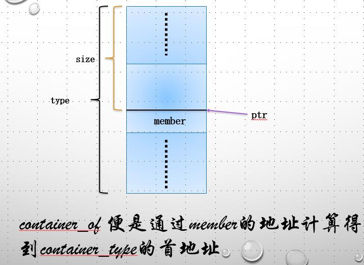
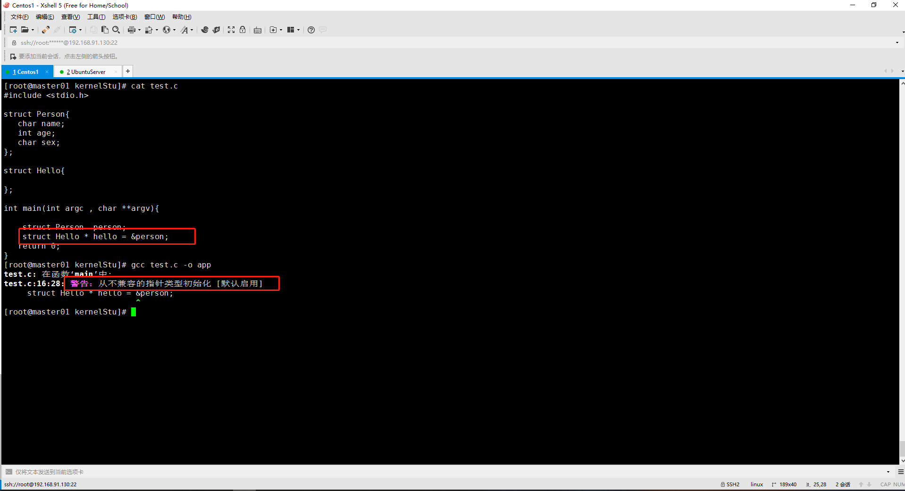

# container_of 宏定义说明
- (或许是一个不错的编程技巧)
## 01.该宏定义的功能
+ 通过结构体中的属性的地址来计算出该结构体的地址。
```c
    /**
       获取任务的任务描述符信息
    */
    struct task_struct *pid_task(struct pid *pid, enum pid_type type)
    {
        struct task_struct *result = NULL;
        if (pid) {
            struct hlist_node *first;
            // 计算出hlist_node的地址，该属性位于struct pid下的tasks(hlist_head类型)的first属性；
            first = rcu_dereference_check(hlist_first_rcu(&pid->tasks[type]),
                            lockdep_tasklist_lock_is_held());
            if (first){
                // 通过hlist_node的地址，计算进程描述符的地址(hlist_node的属性位于struct task 结构体下的pids(pid_like类型)下)
                result = hlist_entry(first, struct task_struct, pids[(type)].node);
            }
            }
        }
        return result;
    }
```
+ 为什么这里可以使用struct pid 里面的tasks来计算进程描述符struct task呢？是通过hlist_node这个类型的属性来关联的。 代码如下
   - struct pid
     ```c
        struct pid
        {
            atomic_t count;
            // pid的级别(深度)
            unsigned int level;
            /* lists of tasks that use this pid */
            // 引用该pid的task
            struct hlist_head tasks[PIDTYPE_MAX];
            struct rcu_head rcu;
            /*
                1. 虽然这里定义的长度为1,但是可以拓展啊。一个PID可以属于不同的namespace， numbers[0]表示global namespace，numbers[i]表示第i层namespace，i越大所在层级越低。
                2. 这样实现的目的是：一个进程可以属于多个进程命名空间
            */
            /*
            numbers 是一个数据，表示一个task_struct在每个namespace下的id(该id就是getpid()所得到的值)，numbers[0]表示最顶层的namespace，level=0，number[1]表示level=1
            */
            struct upid numbers[1]; 
        };

        struct list_head {
            struct list_head *next, *prev;
        };

        struct hlist_head {
            struct hlist_node *first;
        };

        struct hlist_node {
            struct hlist_node *next, **pprev;
        };
     ```
   - struct task
     ```c
         //..........
         	/*
            * children/sibling forms the list of my natural children
            */
            struct list_head children;	/* list of my children */
            struct list_head sibling;	/* linkage in my parent's children list */
            struct task_struct *group_leader;	/* threadgroup leader */

            /*
            * ptraced is the list of tasks this task is using ptrace on.
            * This includes both natural children and PTRACE_ATTACH targets.
            * p->ptrace_entry is p's link on the p->parent->ptraced list.
            */
            struct list_head ptraced;
            struct list_head ptrace_entry;

            /* PID/PID hash table linkage. */
            /**
            * struct pid_link
            {
                struct hlist_node node;
                struct pid *pid;
            };
            */
            // 请注意！！！
            struct pid_link pids[PIDTYPE_MAX];
            struct list_head thread_group;
            struct list_head thread_node;

            struct completion *vfork_done;		/* for vfork() */
            int __user *set_child_tid;		/* CLONE_CHILD_SETTID */
            int __user *clear_child_tid;		/* CLONE_CHILD_CLEARTID */

      // ...................
     ```
## container_of宏定义
+ container_of如何通过结构体成员的地址来计算结构体的地址呢？
+ 原理如下图：

+ 原理如下：
   - 已知结构体type的成员member的地址ptr，求解结构体type的起始地址
       - type的起始地址 = ptr - size; 这里都需要转为char* ， 因为它为字节单位
   - size的计算方式？如下代码(offset)
### 定义如下：
```c
/**
 * container_of - cast a member of a structure out to the containing structure
 * @ptr:	the pointer to the member.
 * @type:	the type of the container struct this is embedded in.
 * @member:	the name of the member within the struct.
 * 从task_struct结构体成员的地址计算出task_struct的地址,即获取task。
 */
#define container_of(ptr, type, member) ({			\
	const typeof( ((type *)0)->member ) *__mptr = (ptr);	\
	(type *)( (char *)__mptr - offsetof(type,member) );})


#define offsetof(TYPE, MEMBER) ((size_t) &((TYPE *)0)->MEMBER)
```
+ 在container_of和offset的宏定义中，0代表什么？
```c
    #include <stdio.h>

    struct Person{
        char name;
        int age;
        char sex;
    };

    int main(int argc , char **argv){

        struct Person  person;

        printf("%p\n",&person); // 0x7fff22f2d890
        printf("%p\n",&person.sex); // 0x7fff22f2d890
        printf("%d\n",&((struct Person*) 0)->sex); // 8

        return 0;
    }
```
####  重点
+ &((struct Person*)0)->sex的作用就是计算属性sex到结构体起始地址的字节数，即size。
+ 在这里，0被强制转换为了struct Person\*类型，他的作用就是作为指向该结构体地址地址的指针，而&((struct Person*)0)->sex则是求sex到该起始指针的字节数，其实就是求相对地址。起始位置为0，则&sex的值便是size的大小了。
+ 另外，const typeof( ((type *)0)->member ) *__mptr = (ptr);这里的作用是什么呢？
   - 即：定义了一个新的指针，将ptr的值赋值给__mptr.但是为什么这么做呢？即若开发者使用时输入的参数有问题，ptr和member的类型不匹配，编译时便会有warning。如下:
   