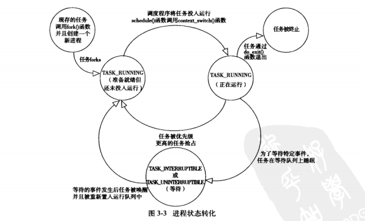
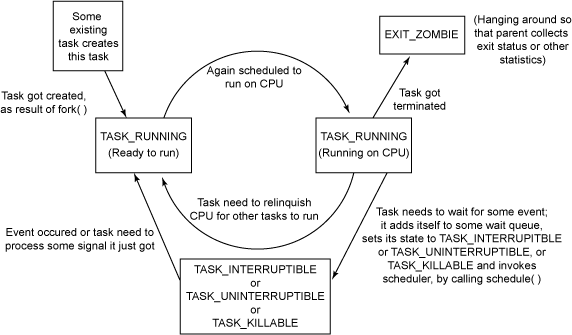
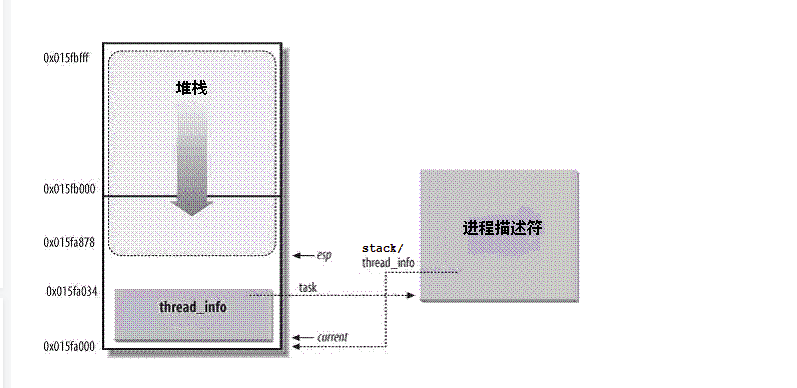

## task_struct(进程描述符)
+  内核版本4.5.1
### task_struct结构体
```c
    struct task_struct {
        volatile long state;	/* -1 unrunnable, 0 runnable, >0 stopped */ //进程状态
        void *stack;  //
        atomic_t usage; //
        unsigned int flags;	/* per process flags, defined below */ // 
        unsigned int ptrace; //

    #ifdef CONFIG_SMP
        struct llist_node wake_entry;
        int on_cpu;
        unsigned int wakee_flips;
        unsigned long wakee_flip_decay_ts;
        struct task_struct *last_wakee;

        int wake_cpu;
    #endif
        int on_rq;

        int prio, static_prio, normal_prio;
        unsigned int rt_priority;
        const struct sched_class *sched_class;
        struct sched_entity se;
        struct sched_rt_entity rt;
    #ifdef CONFIG_CGROUP_SCHED
        struct task_group *sched_task_group;
    #endif
        struct sched_dl_entity dl;

    #ifdef CONFIG_PREEMPT_NOTIFIERS
        /* list of struct preempt_notifier: */
        struct hlist_head preempt_notifiers;
    #endif

    #ifdef CONFIG_BLK_DEV_IO_TRACE
        unsigned int btrace_seq;
    #endif

        unsigned int policy;
        int nr_cpus_allowed;
        cpumask_t cpus_allowed;

    #ifdef CONFIG_PREEMPT_RCU
        int rcu_read_lock_nesting;
        union rcu_special rcu_read_unlock_special;
        struct list_head rcu_node_entry;
        struct rcu_node *rcu_blocked_node;
    #endif /* #ifdef CONFIG_PREEMPT_RCU */
    #ifdef CONFIG_TASKS_RCU
        unsigned long rcu_tasks_nvcsw;
        bool rcu_tasks_holdout;
        struct list_head rcu_tasks_holdout_list;
        int rcu_tasks_idle_cpu;
    #endif /* #ifdef CONFIG_TASKS_RCU */

    #ifdef CONFIG_SCHED_INFO
        struct sched_info sched_info;
    #endif

        struct list_head tasks;
    #ifdef CONFIG_SMP
        struct plist_node pushable_tasks;
        struct rb_node pushable_dl_tasks;
    #endif

        struct mm_struct *mm, *active_mm;
        /* per-thread vma caching */
        u32 vmacache_seqnum;
        struct vm_area_struct *vmacache[VMACACHE_SIZE];
    #if defined(SPLIT_RSS_COUNTING)
        struct task_rss_stat	rss_stat;
    #endif
    /* task state */
        int exit_state; //进程退出状态
        int exit_code, exit_signal;
        int pdeath_signal;  /*  The signal sent when the parent dies  */
        unsigned long jobctl;	/* JOBCTL_*, siglock protected */

        /* Used for emulating ABI behavior of previous Linux versions */
        unsigned int personality;

        /* scheduler bits, serialized by scheduler locks */
        unsigned sched_reset_on_fork:1;
        unsigned sched_contributes_to_load:1;
        unsigned sched_migrated:1;
        unsigned :0; /* force alignment to the next boundary */

        /* unserialized, strictly 'current' */
        unsigned in_execve:1; /* bit to tell LSMs we're in execve */
        unsigned in_iowait:1;
    #ifdef CONFIG_MEMCG
        unsigned memcg_may_oom:1;
    #ifndef CONFIG_SLOB
        unsigned memcg_kmem_skip_account:1;
    #endif
    #endif
    #ifdef CONFIG_COMPAT_BRK
        unsigned brk_randomized:1;
    #endif

        unsigned long atomic_flags; /* Flags needing atomic access. */

        struct restart_block restart_block;

        pid_t pid; //进程描述符
        pid_t tgid; //线程组id，一个线程组所有线程与领头线程具有相同的pid。getpid()返回该字段的值

    #ifdef CONFIG_CC_STACKPROTECTOR
        /* Canary value for the -fstack-protector gcc feature */
        unsigned long stack_canary;
    #endif
        /*
        * pointers to (original) parent process, youngest child, younger sibling,
        * older sibling, respectively.  (p->father can be replaced with
        * p->real_parent->pid)
        */
        struct task_struct __rcu *real_parent; /* real parent process */
        struct task_struct __rcu *parent; /* recipient of SIGCHLD, wait4() reports */
        /*
        * children/sibling forms the list of my natural children
        */
        struct list_head children;	/* list of my children */
        struct list_head sibling;	/* linkage in my parent's children list */
        struct task_struct *group_leader;	/* threadgroup leader */

        /*
        * ptraced is the list of tasks this task is using ptrace on.
        * This includes both natural children and PTRACE_ATTACH targets.
        * p->ptrace_entry is p's link on the p->parent->ptraced list.
        */
        struct list_head ptraced;
        struct list_head ptrace_entry;

        /* PID/PID hash table linkage. */
        struct pid_link pids[PIDTYPE_MAX];
        struct list_head thread_group;
        struct list_head thread_node;

        struct completion *vfork_done;		/* for vfork() */
        int __user *set_child_tid;		/* CLONE_CHILD_SETTID */
        int __user *clear_child_tid;		/* CLONE_CHILD_CLEARTID */

        cputime_t utime, stime, utimescaled, stimescaled;
        cputime_t gtime;
        struct prev_cputime prev_cputime;
    #ifdef CONFIG_VIRT_CPU_ACCOUNTING_GEN
        seqcount_t vtime_seqcount;
        unsigned long long vtime_snap;
        enum {
            /* Task is sleeping or running in a CPU with VTIME inactive */
            VTIME_INACTIVE = 0,
            /* Task runs in userspace in a CPU with VTIME active */
            VTIME_USER,
            /* Task runs in kernelspace in a CPU with VTIME active */
            VTIME_SYS,
        } vtime_snap_whence;
    #endif
        unsigned long nvcsw, nivcsw; /* context switch counts */
        u64 start_time;		/* monotonic time in nsec */
        u64 real_start_time;	/* boot based time in nsec */
    /* mm fault and swap info: this can arguably be seen as either mm-specific or thread-specific */
        unsigned long min_flt, maj_flt;

        struct task_cputime cputime_expires;
        struct list_head cpu_timers[3];

    /* process credentials */
        const struct cred __rcu *real_cred; /* objective and real subjective task
                        * credentials (COW) */
        const struct cred __rcu *cred;	/* effective (overridable) subjective task
                        * credentials (COW) */
        char comm[TASK_COMM_LEN]; /* executable name excluding path
                        - access with [gs]et_task_comm (which lock
                        it with task_lock())
                        - initialized normally by setup_new_exec */
    /* file system info */
        struct nameidata *nameidata;
    #ifdef CONFIG_SYSVIPC
    /* ipc stuff */
        struct sysv_sem sysvsem;
        struct sysv_shm sysvshm;
    #endif
    #ifdef CONFIG_DETECT_HUNG_TASK
    /* hung task detection */
        unsigned long last_switch_count;
    #endif
    /* filesystem information */
        struct fs_struct *fs;
    /* open file information */
        struct files_struct *files;
    /* namespaces */
        struct nsproxy *nsproxy;
    /* signal handlers */
        struct signal_struct *signal;
        struct sighand_struct *sighand;

        sigset_t blocked, real_blocked;
        sigset_t saved_sigmask;	/* restored if set_restore_sigmask() was used */
        struct sigpending pending;

        unsigned long sas_ss_sp;
        size_t sas_ss_size;

        struct callback_head *task_works;

        struct audit_context *audit_context;
    #ifdef CONFIG_AUDITSYSCALL
        kuid_t loginuid;
        unsigned int sessionid;
    #endif
        struct seccomp seccomp;

    /* Thread group tracking */
        u32 parent_exec_id;
        u32 self_exec_id;
    /* Protection of (de-)allocation: mm, files, fs, tty, keyrings, mems_allowed,
    * mempolicy */
        spinlock_t alloc_lock;

        /* Protection of the PI data structures: */
        raw_spinlock_t pi_lock;

        struct wake_q_node wake_q;

    #ifdef CONFIG_RT_MUTEXES
        /* PI waiters blocked on a rt_mutex held by this task */
        struct rb_root pi_waiters;
        struct rb_node *pi_waiters_leftmost;
        /* Deadlock detection and priority inheritance handling */
        struct rt_mutex_waiter *pi_blocked_on;
    #endif

    #ifdef CONFIG_DEBUG_MUTEXES
        /* mutex deadlock detection */
        struct mutex_waiter *blocked_on;
    #endif
    #ifdef CONFIG_TRACE_IRQFLAGS
        unsigned int irq_events;
        unsigned long hardirq_enable_ip;
        unsigned long hardirq_disable_ip;
        unsigned int hardirq_enable_event;
        unsigned int hardirq_disable_event;
        int hardirqs_enabled;
        int hardirq_context;
        unsigned long softirq_disable_ip;
        unsigned long softirq_enable_ip;
        unsigned int softirq_disable_event;
        unsigned int softirq_enable_event;
        int softirqs_enabled;
        int softirq_context;
    #endif
    #ifdef CONFIG_LOCKDEP
    # define MAX_LOCK_DEPTH 48UL
        u64 curr_chain_key;
        int lockdep_depth;
        unsigned int lockdep_recursion;
        struct held_lock held_locks[MAX_LOCK_DEPTH];
        gfp_t lockdep_reclaim_gfp;
    #endif
    #ifdef CONFIG_UBSAN
        unsigned int in_ubsan;
    #endif

    /* journalling filesystem info */
        void *journal_info;

    /* stacked block device info */
        struct bio_list *bio_list;

    #ifdef CONFIG_BLOCK
    /* stack plugging */
        struct blk_plug *plug;
    #endif

    /* VM state */
        struct reclaim_state *reclaim_state;

        struct backing_dev_info *backing_dev_info;

        struct io_context *io_context;

        unsigned long ptrace_message;
        siginfo_t *last_siginfo; /* For ptrace use.  */
        struct task_io_accounting ioac;
    #if defined(CONFIG_TASK_XACCT)
        u64 acct_rss_mem1;	/* accumulated rss usage */
        u64 acct_vm_mem1;	/* accumulated virtual memory usage */
        cputime_t acct_timexpd;	/* stime + utime since last update */
    #endif
    #ifdef CONFIG_CPUSETS
        nodemask_t mems_allowed;	/* Protected by alloc_lock */
        seqcount_t mems_allowed_seq;	/* Seqence no to catch updates */
        int cpuset_mem_spread_rotor;
        int cpuset_slab_spread_rotor;
    #endif
    #ifdef CONFIG_CGROUPS
        /* Control Group info protected by css_set_lock */
        struct css_set __rcu *cgroups;
        /* cg_list protected by css_set_lock and tsk->alloc_lock */
        struct list_head cg_list;
    #endif
    #ifdef CONFIG_FUTEX
        struct robust_list_head __user *robust_list;
    #ifdef CONFIG_COMPAT
        struct compat_robust_list_head __user *compat_robust_list;
    #endif
        struct list_head pi_state_list;
        struct futex_pi_state *pi_state_cache;
    #endif
    #ifdef CONFIG_PERF_EVENTS
        struct perf_event_context *perf_event_ctxp[perf_nr_task_contexts];
        struct mutex perf_event_mutex;
        struct list_head perf_event_list;
    #endif
    #ifdef CONFIG_DEBUG_PREEMPT
        unsigned long preempt_disable_ip;
    #endif
    #ifdef CONFIG_NUMA
        struct mempolicy *mempolicy;	/* Protected by alloc_lock */
        short il_next;
        short pref_node_fork;
    #endif
    #ifdef CONFIG_NUMA_BALANCING
        int numa_scan_seq;
        unsigned int numa_scan_period;
        unsigned int numa_scan_period_max;
        int numa_preferred_nid;
        unsigned long numa_migrate_retry;
        u64 node_stamp;			/* migration stamp  */
        u64 last_task_numa_placement;
        u64 last_sum_exec_runtime;
        struct callback_head numa_work;

        struct list_head numa_entry;
        struct numa_group *numa_group;

        /*
        * numa_faults is an array split into four regions:
        * faults_memory, faults_cpu, faults_memory_buffer, faults_cpu_buffer
        * in this precise order.
        *
        * faults_memory: Exponential decaying average of faults on a per-node
        * basis. Scheduling placement decisions are made based on these
        * counts. The values remain static for the duration of a PTE scan.
        * faults_cpu: Track the nodes the process was running on when a NUMA
        * hinting fault was incurred.
        * faults_memory_buffer and faults_cpu_buffer: Record faults per node
        * during the current scan window. When the scan completes, the counts
        * in faults_memory and faults_cpu decay and these values are copied.
        */
        unsigned long *numa_faults;
        unsigned long total_numa_faults;

        /*
        * numa_faults_locality tracks if faults recorded during the last
        * scan window were remote/local or failed to migrate. The task scan
        * period is adapted based on the locality of the faults with different
        * weights depending on whether they were shared or private faults
        */
        unsigned long numa_faults_locality[3];

        unsigned long numa_pages_migrated;
    #endif /* CONFIG_NUMA_BALANCING */

    #ifdef CONFIG_ARCH_WANT_BATCHED_UNMAP_TLB_FLUSH
        struct tlbflush_unmap_batch tlb_ubc;
    #endif

        struct rcu_head rcu;

        /*
        * cache last used pipe for splice
        */
        struct pipe_inode_info *splice_pipe;

        struct page_frag task_frag;

    #ifdef	CONFIG_TASK_DELAY_ACCT
        struct task_delay_info *delays;
    #endif
    #ifdef CONFIG_FAULT_INJECTION
        int make_it_fail;
    #endif
        /*
        * when (nr_dirtied >= nr_dirtied_pause), it's time to call
        * balance_dirty_pages() for some dirty throttling pause
        */
        int nr_dirtied;
        int nr_dirtied_pause;
        unsigned long dirty_paused_when; /* start of a write-and-pause period */

    #ifdef CONFIG_LATENCYTOP
        int latency_record_count;
        struct latency_record latency_record[LT_SAVECOUNT];
    #endif
        /*
        * time slack values; these are used to round up poll() and
        * select() etc timeout values. These are in nanoseconds.
        */
        unsigned long timer_slack_ns;
        unsigned long default_timer_slack_ns;

    #ifdef CONFIG_KASAN
        unsigned int kasan_depth;
    #endif
    #ifdef CONFIG_FUNCTION_GRAPH_TRACER
        /* Index of current stored address in ret_stack */
        int curr_ret_stack;
        /* Stack of return addresses for return function tracing */
        struct ftrace_ret_stack	*ret_stack;
        /* time stamp for last schedule */
        unsigned long long ftrace_timestamp;
        /*
        * Number of functions that haven't been traced
        * because of depth overrun.
        */
        atomic_t trace_overrun;
        /* Pause for the tracing */
        atomic_t tracing_graph_pause;
    #endif
    #ifdef CONFIG_TRACING
        /* state flags for use by tracers */
        unsigned long trace;
        /* bitmask and counter of trace recursion */
        unsigned long trace_recursion;
    #endif /* CONFIG_TRACING */
    #ifdef CONFIG_MEMCG
        struct mem_cgroup *memcg_in_oom;
        gfp_t memcg_oom_gfp_mask;
        int memcg_oom_order;

        /* number of pages to reclaim on returning to userland */
        unsigned int memcg_nr_pages_over_high;
    #endif
    #ifdef CONFIG_UPROBES
        struct uprobe_task *utask;
    #endif
    #if defined(CONFIG_BCACHE) || defined(CONFIG_BCACHE_MODULE)
        unsigned int	sequential_io;
        unsigned int	sequential_io_avg;
    #endif
    #ifdef CONFIG_DEBUG_ATOMIC_SLEEP
        unsigned long	task_state_change;
    #endif
        int pagefault_disabled;
    /* CPU-specific state of this task */
        struct thread_struct thread;
    /*
    * WARNING: on x86, 'thread_struct' contains a variable-sized
    * structure.  It *MUST* be at the end of 'task_struct'.
    *
    * Do not put anything below here!
    */
    };
```
### task_struct 结构体字段详解
### 1. exit_state
|状态|含义|
|---|---|
|EXIT_ZOMBIE|进程的执行被终止，但是其父进程还没有使用wait()等系统调用来获知它的终止信息，此时进程成为僵尸进程|
|EXIT_DEAD|进程的最终状态|
### 2. state
|状态|含义|
|---|---|
|TASK_RUNNING(运行)|进程是可执行的;或者他正在执行;或者在运行队列中等待执行。这是进程在用户空间中执行的唯一可能的状态;这种状态也可运用到内核空间中正在执行的进程|
|TASK_INTERRUPTIBLE(可中断)|进程正在休眠(被阻塞),等待某些条件的达成。一旦这些条件达成，内核就会把进程状态设置为运行。处于此状态的进程因为接收到信号而提前被唤醒并随时准备投入运行|
|TASK_UNINTERRUPTIBLE(不可中断)|就算是接收到信号也不会被唤醒或准备投入运行，其他的与TASK——INTERRUPTIBLE一致。即只有他所等待的资源可以使用的时候，他才会被唤醒。保障了进程在等待时不受干扰|
|_TASK_TRACED|被其他进程跟踪的进程|
|_TASK_STOPPED(停止)|进程停止运行。进程接收到sigstop,sigtstp,sigttin,sigttou信号时就会进入该状态|
#### 进程状态转换图
1. 
<div></div>

2.  
<div></div>

### 2. pid进程标识符
+ Unix系统允许用户使用一个叫进程标识符(process ID),即PID，来标识进程。PID存放在进程描述符(task_struct)的pid字段中。PID被顺序编号。
+ Linux把不同的PID与系统中的每个进程或者轻量级进程相关联，这样保证了系统中每个执行上下文都可以被唯一识别
   - pid是唯一的
   - 每一个进程都是唯一的
+ Unix系统的程序员**希望**同一组中的线程有共同的PID。例如：应该可以将信号发送到指定PID的一组线程，这个信号会作用于该组中所有的线程。**POSIX 1003.1c标准规定了一个多线程应用程序中的所有线程都必须有相同的PID**
   - Linux线程组的概念(为了遵守POSIX 1003.1c标准，因此引入了tgid这个字段)
     1. Linux中线程组的表示:一个线程组中所有的线程使用和该线程组领头线程(thread group leader)相同的PID，也就是该组中的第一个轻量级进程的PID，他被存入进程描述符的tgid字段中。getpid()系统调用返回的是当前进程的tgid值而不是pid的值。
     2. 因第一点，现在所有的线程共享相同的PID。线程组的领头线程其pid与tgid的值相同
+ 我的理解
  1. 同一线程组内，线程（轻量级**进程**）的pid值不一致，tgid一致。[正确]
  2. 领头的线程的pid与tgid一致
##### pidmap_array(PID位图)
+ 由于循环使用PID编号，内核必须通过管理一个pidmap_array位图来表示当前已分配的PID号和闲置的PID号。pidmap_arra会被系统一直保存在系统的页中不被释放
### 3.进程描述符处理 void *stack;
对于每一个进程来说，Linux都把两个不同的数据结构紧凑的放在一个单独为进程分配的存储区域内.一个是与进程描述符相关的小数据结构thread_info(线程描述符);另一个是内核态的进程堆栈。这块存储区域的大小通常为8192个字节(两个页框)。
#### 在内存区存放两种数据结构的方式 ， 如下图
<div></div>  

+  线程描述符驻留在这个内存区域的开始，而栈从末端开始向下增长。
    - 为了只要通过栈指针就能计算出他的位置，避免使用额外的寄存器专门记录。即只需要检查栈就可以获得当前正确的进程
+ 分别通过task和thread_info字段使得thread_info和task_struct结构相互关联
+ thread_info结构和进程内核栈存放在两个连续的页框中
#### 代码分析
+ C语言使用联合结构表示一个进程的线程描述符和内核栈(include/linux/sched.h)
    ```c
    //#define THREAD_SIZE		(PAGE_SIZE << THREAD_SIZE_ORDER) //文件 arch/score/include/asm/thread_info.h
    union thread_union {
        struct thread_info thread_info;
        unsigned long stack[THREAD_SIZE/sizeof(long)];
    };

    //.....
    //从这两个宏来看联合体的使用
    #define task_thread_info(task)	((struct thread_info *)(task)->stack)
    #define task_stack_page(task)	((task)->stack)

    static inline void setup_thread_stack(struct task_struct *p, struct task_struct *org)
    {
        *task_thread_info(p) = *task_thread_info(org);
        task_thread_info(p)->task = p;
    }
    ```
    - 内核使用alloc_thread_info和free_thread_info宏(新版内核使用函数来完成这两个动作)分配和释放存储thread_info结构和内核栈的内存区
    ```c
        # if THREAD_SIZE >= PAGE_SIZE
        static struct thread_info *alloc_thread_info_node(struct task_struct *tsk,
                                int node)
        {
            struct page *page = alloc_kmem_pages_node(node, THREADINFO_GFP,
                                THREAD_SIZE_ORDER);

            return page ? page_address(page) : NULL;
        }

        static inline void free_thread_info(struct thread_info *ti)
        {
            free_kmem_pages((unsigned long)ti, THREAD_SIZE_ORDER);
        }
        # else
        static struct kmem_cache *thread_info_cache;

        static struct thread_info *alloc_thread_info_node(struct task_struct *tsk,
                                int node)
        {
            return kmem_cache_alloc_node(thread_info_cache, THREADINFO_GFP, node);
        }

        static void free_thread_info(struct thread_info *ti)
        {
            kmem_cache_free(thread_info_cache, ti);
        }

        void thread_info_cache_init(void)
        {
            thread_info_cache = kmem_cache_create("thread_info", THREAD_SIZE,
                                THREAD_SIZE, 0, NULL);
            BUG_ON(thread_info_cache == NULL);
        }
        # endif
    ```
### 4. 进程标记  unsigned int flags;
+ 反映进程的状态，但并不是运行状态，用于内核识别进程当前的状态，以备下一步操作
+ 可以取的值:
```c
    /*
    * Per process flags
    */
    #define PF_EXITING	0x00000004	/* getting shut down 进程开始关闭*/
    #define PF_EXITPIDONE	0x00000008	/* pi exit done on shut down */
    #define PF_VCPU		0x00000010	/* I'm a virtual CPU */
    #define PF_WQ_WORKER	0x00000020	/* I'm a workqueue worker */
    #define PF_FORKNOEXEC	0x00000040	/* forked but didn't exec 进程刚创建，但还没执行*/
    #define PF_MCE_PROCESS  0x00000080      /* process policy on mce errors */
    #define PF_SUPERPRIV	0x00000100	/* used super-user privileges  超级用户特权*/
    #define PF_DUMPCORE	0x00000200	/* dumped core 标识进程是否清空core文件*/
    #define PF_SIGNALED	0x00000400	/* killed by a signal 进程被信号(signal)杀出*/
    #define PF_MEMALLOC	0x00000800	/* Allocating memory 进程分配内存标识 */
    #define PF_NPROC_EXCEEDED 0x00001000	/* set_user noticed that RLIMIT_NPROC was exceeded */
    #define PF_USED_MATH	0x00002000	/* if unset the fpu must be initialized before use */
    #define PF_USED_ASYNC	0x00004000	/* used async_schedule*(), used by module init */
    #define PF_NOFREEZE	0x00008000	/* this thread should not be frozen */
    #define PF_FROZEN	0x00010000	/* frozen for system suspend */
    #define PF_FSTRANS	0x00020000	/* inside a filesystem transaction */
    #define PF_KSWAPD	0x00040000	/* I am kswapd */
    #define PF_MEMALLOC_NOIO 0x00080000	/* Allocating memory without IO involved */
    #define PF_LESS_THROTTLE 0x00100000	/* Throttle me less: I clean memory */
    #define PF_KTHREAD	0x00200000	/* I am a kernel thread */
    #define PF_RANDOMIZE	0x00400000	/* randomize virtual address space */
    #define PF_SWAPWRITE	0x00800000	/* Allowed to write to swap */
    #define PF_NO_SETAFFINITY 0x04000000	/* Userland is not allowed to meddle with cpus_allowed */
    #define PF_MCE_EARLY    0x08000000      /* Early kill for mce process policy */
    #define PF_MUTEX_TESTER	0x20000000	/* Thread belongs to the rt mutex tester */
    #define PF_FREEZER_SKIP	0x40000000	/* Freezer should not count it as freezable */
    #define PF_SUSPEND_TASK 0x80000000      /* this thread called freeze_processes and should not be frozen */
```
### 5 进程亲属关系
```c
    /*
        * pointers to (original) parent process, youngest child, younger sibling,
        * older sibling(兄弟姐妹), respectively.  (p->father can be replaced with
        * p->real_parent->pid)
        */
        struct task_struct __rcu *real_parent; /* real parent process  指向其父进程，如果创建他的父进程不存在,那么就会指向pid为1的init进程*/
        struct task_struct __rcu *parent; /* recipient of SIGCHLD, wait4() reports 指向其父进程，当他终止时，必须要向他的父进程发送信号。他的值通常与real_parent相同*/
        /*
        * children/sibling forms the list of my natural children
        */
        struct list_head children;	/* list of my children  表示链表的头部，链表中的元素都是他的子进程*/
        struct list_head sibling;	/* linkage in my parent's children list 用于将当前进程插入到兄弟链表中*/
        struct task_struct *group_leader;	/* threadgroup leader  指向该进程所在线程组的领头进程*/
```
### 6. ptrace系统调用  
+ 父进程可以控制子进程运行，并且可以检查和改变他的核心image
   - 主要用来断点调试
```c
    unsigned int ptrace;
    /*
	 * ptraced is the list of tasks this task is using ptrace on.
	 * This includes both natural children and PTRACE_ATTACH targets.
	 * p->ptrace_entry is p's link on the p->parent->ptraced list.
	 */
	struct list_head ptraced;
	struct list_head ptrace_entry;

    unsigned long ptrace_message;
	siginfo_t *last_siginfo; /* For ptrace use.  */
```
### 7.性能诊断工具Performance Event
Performance Event是一款随 Linux 内核代码一同发布和维护的性能诊断工具。这些成员用于帮助PerformanceEvent分析进程的性能问题
```c
    #ifdef CONFIG_PERF_EVENTS
        struct perf_event_context *perf_event_ctxp[perf_nr_task_contexts];
        struct mutex perf_event_mutex;
        struct list_head perf_event_list;
    #endif
```
### 进程调度相关
#### 优先级
```c
    /*
       prio:动态优先级。prio 的值是调度器最终使用的优先级数值，即调度器选择一个进程时实际选择的值。prio 值越小，表明进程的优先级越高
       static_prio:静态优先级，内核不会主动修改它，只能通过nice系统调用来设置
       normal_prio:归一化优先级，值取决于静态优先级和调度策略。

       rt_priority:用于保存实时优先级
    */
    int prio, static_prio, normal_prio;
	unsigned int rt_priority;
```
#### 调度策略相关
```c
    // 调度类
    const struct sched_class *sched_class;
    //普通进程的调用实体，每个进程都有其中之一的实体 ？
	struct sched_entity se;
	//实时进程的调用实体，每个进程都有其中之一的实体
    struct sched_rt_entity rt;

    // 调度策略
    unsigned int policy;
    //可使用的cpu的个数
	int nr_cpus_allowed;
    //用户控制进程可以在哪些cpu上运行
	cpumask_t cpus_allowed;
```
##### 调度策略的种类  unsigned int policy;
```c
    /**
    * Scheduling policies
    */
    //（也叫SCHED_OTHER）用于普通进程，通过CFS调度器实现。SCHED_BATCH用于非交互的处理器消耗型进程。SCHED_IDLE是在系统负载很低时使用
    #define SCHED_NORMAL		0
    /*
      先入先出调度算法（实时调度策略），相同优先级的任务先到先服务，高优先级的任务可以抢占低优先级的任务 
    */
    #define SCHED_FIFO		1
    /*
     轮流调度算法（实时调度策略），后 者提供 Roound-Robin 语义，采用时间片，相同优先级的任务当用完时间片会被放到队列尾部，以保证公平性，同样，高优先级的任务可以抢占低优先级的任务。不同要求的实时任务可以根据需要用sched_setscheduler()API 设置策略
    */
    #define SCHED_RR		2
    /*
    SCHED_NORMAL普通进程策略的分化版本。采用分时策略，根据动态优先级(可用nice()API设置），分配 CPU 运算资源。注意：这类进程比上述两类实时进程优先级低，换言之，在有实时进程存在时，实时进程优先调度。但针对吞吐量优化
    */
    #define SCHED_BATCH		3
    /* SCHED_ISO: reserved but not implemented yet */
    /*
    优先级最低，在系统空闲时才跑这类进程(如利用闲散计算机资源跑地外文明搜索，蛋白质结构分析等任务，是此调度策略的适用者）
    */
    #define SCHED_IDLE		5
    /*
       新支持的实时进程调度策略，针对突发型计算，且对延迟和完成时间高度敏感的任务适用。基于Earliest Deadline First (EDF) 调度算法
    */
    #define SCHED_DEADLINE		6

    /* Can be ORed in to make sure the process is reverted back to SCHED_NORMAL on fork */
    #define SCHED_RESET_ON_FORK     0x40000000

    /*
    * For the sched_{set,get}attr() calls
    */
    #define SCHED_FLAG_RESET_ON_FORK	0x01

```
 ##### 调度器类  const struct sched_class *sched_class;
 + rt: real-time
 ```c
    /*
    优先级最高的线程，会中断所有其他线程，且不会被其他任务打断。作用：1.发生在cpu_stop_cpu_callback 进行cpu之间任务migration；2.HOTPLUG_CPU的情况下关闭任务。
    */
    extern const struct sched_class stop_sched_class;
    /*
      deadline调度类，实时调度中较高级别的调度类型，一般之后在系统紧急情况下会调用；
    */
    extern const struct sched_class dl_sched_class;
    /*
       RT，作用：实时线程
    */
    extern const struct sched_class rt_sched_class;
    /*
      CFS（公平），作用：一般常规线程
    */
    extern const struct sched_class fair_sched_class;
    /*
    每个cup的第一个pid=0线程：swapper，是一个静态线程。调度类属于：idel_sched_class，所以在ps里面是看不到的。一般运行在开机过程和cpu异常的时候做dump
    */
    extern const struct sched_class idle_sched_class;
 ```
 + 优先级:Scheduling Class的优先级顺序为StopTask > RealTime > Fair > IdleTask
##### 进程地址空间
```c
/**
    url:https://www.kernel.org/doc/Documentation/vm/active_mm.txt
    https://www.cnblogs.com/Rofael/archive/2013/04/13/3019153.html
    mm:进程所拥有的用户空间内存描述符，内核进程mm为NULL
    active_mm: 
*/
	struct mm_struct *mm, *active_mm;
	/* per-thread vma caching */
	u32 vmacache_seqnum;
	struct vm_area_struct *vmacache[VMACACHE_SIZE];

    #if defined(SPLIT_RSS_COUNTING)
            struct task_rss_stat	rss_stat;
    #endif

    #ifdef CONFIG_COMPAT_BRK
	   unsigned brk_randomized:1;
    #endif

    /**
    对Linux来说，用户进程和内核线程（kernel thread)都是task_struct的实例，唯一的区别是kernel thread是没有进程地址空间的，内核线程也没有mm描述符的，所以内核线程的tsk->mm域是空（NULL）。内核scheduler在进程context switching的时候，会根据tsk->mm判断即将调度的进程是用户进程还是内核线程。但是虽然thread thread不用访问用户进程地址空间，但是仍然需要page table来访问kernel自己的空间。但是幸运的是，对于任何用户进程来说，他们的内核空间都是100%相同的，所以内核可以’borrow'上一个被调用的用户进程的mm中的页表来访问内核地址，这个mm就记录在active_mm。
     1. 内核进程不访问用户进程地址空间
     2. 内核进程没有进程地址空间
     3. 内核进程需要访问内核空间。内核进程需要使用页表(task_struct->active_mm)来访问内核空间
    */
```
+ **CONFIG_COMPAT_BRK**: 内核中brk相关的变量很多指的都是堆（heap），这个配置选项 “CONFIG_COMPAT_BRK=y means that heap randomization is turned off, so it's *always* a safe choice.  I assume the help text is trying to say that if one does not run ancient binaries, then enabling heap randomization is safe.”所以该配置=y指的是关闭堆地址空间随机化技术来支持一些老的binary（COMPAT选项一般都是向后兼容的选项)
+ 解释
  - mm: 进程所拥有的用户空间内存描述符，内核线程无的mm为NULL
  - active_mm: active_mm指向进程运行时所使用的内存描述符
  - brk_randomized: 用来确定对随机堆内存的探测 --> http://lkml.iu.edu/hypermail/linux/kernel/1104.1/00196.html
  - rss_stat: 用来记录缓冲信息
##### 判断标识
```c
    int exit_code, exit_signal;
	int pdeath_signal;  /*  The signal sent when the parent dies  */
	unsigned long jobctl;	/* JOBCTL_*, siglock protected */

	/* Used for emulating ABI behavior of previous Linux versions */
	unsigned int personality;

	/* scheduler bits, serialized by scheduler locks */
	unsigned sched_reset_on_fork:1;
	unsigned sched_contributes_to_load:1;
	unsigned sched_migrated:1;
	unsigned :0; /* force alignment to the next boundary */

	/* unserialized, strictly 'current' */
	unsigned in_execve:1; /* bit to tell LSMs we're in execve */
	unsigned in_iowait:1;
```
+ exit_code:用于设置进程的终止代号，这个值要么是_exit()或exit_group()系统调用参数（正常终止），要么是由内核提供的一个错误代号（异常终止）
+ exit_signal:用于设置进程的终止代号，这个值要么是_exit()或exit_group()系统调用参数（正常终止），要么是由内核提供的一个错误代号（异常终止）
+ jobctl:
+ personality:用于处理不同的API
+ sched_reset_on_fork:用于判断是否恢复默认的优先级或调度策略
+ sched_contributes_to_load:
+ sched_migrated:
+ in_execve:于通知LSM是否被do_execve()函数所调用
+ in_iowait:用于判断是否进行iowait计数
+ pdeath_signal:用于判断父进程终止时发送信号。
##### 时间
```c
	cputime_t utime, stime, utimescaled, stimescaled;
	cputime_t gtime;
	struct prev_cputime prev_cputime;
#ifdef CONFIG_VIRT_CPU_ACCOUNTING_GEN
	seqcount_t vtime_seqcount;
	unsigned long long vtime_snap;
	enum {
		/* Task is sleeping or running in a CPU with VTIME inactive */
		VTIME_INACTIVE = 0,
		/* Task runs in userspace in a CPU with VTIME active */
		VTIME_USER,
		/* Task runs in kernelspace in a CPU with VTIME active */
		VTIME_SYS,
	} vtime_snap_whence;
#endif
	unsigned long nvcsw, nivcsw; /* context switch counts */
	u64 start_time;		/* monotonic time in nsec */
	u64 real_start_time;	/* boot based time in nsec */
/* mm fault and swap info: this can arguably be seen as either mm-specific or thread-specific */
	unsigned long min_flt, maj_flt;

	struct task_cputime cputime_expires;
	struct list_head cpu_timers[3];

/* process credentials */
	const struct cred __rcu *real_cred; /* objective and real subjective task
					 * credentials (COW) */
	const struct cred __rcu *cred;	/* effective (overridable) subjective task
					 * credentials (COW) */
	char comm[TASK_COMM_LEN]; /* executable name excluding path
				     - access with [gs]et_task_comm (which lock
				       it with task_lock())
				     - initialized normally by setup_new_exec */
/* file system info */
	struct nameidata *nameidata;
#ifdef CONFIG_SYSVIPC
/* ipc stuff */
	struct sysv_sem sysvsem;
	struct sysv_shm sysvshm;
#endif
#ifdef CONFIG_DETECT_HUNG_TASK
/* hung task detection */
	unsigned long last_switch_count;
```

##### 信号处理
```c
    struct signal_struct *signal;
	struct sighand_struct *sighand;

	sigset_t blocked, real_blocked;
	sigset_t saved_sigmask;	/* restored if set_restore_sigmask() was used */
	struct sigpending pending;

	unsigned long sas_ss_sp;
	size_t sas_ss_size;
```
+ signal	指向进程的信号描述符
+ sighand	指向进程的信号处理程序描述符
+ blocked	表示被阻塞信号的掩码，real_blocked表示临时掩码
+ pending	存放私有挂起信号的数据结构
+ sas_ss_sp	是信号处理程序备用堆栈的地址，sas_ss_size表示堆栈的大小
##### 其他，待补充