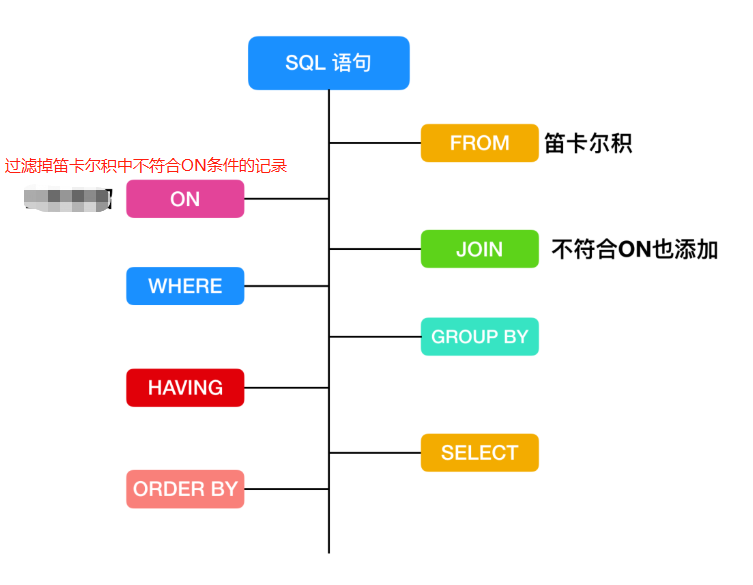

# MySQL执行顺序

## 注意事项
+ SQL执行的每一步，都会为下一步生成一个虚拟表
## 第一步： FROM 连接
+ 对SELECT语句进行查询的时候，首先会对FROM两边的表执行连接，会形成**笛卡尔积**，这时候会产生一个虚表VT1.
## 第二步： ON连接
+ 对FROM连接的结果进行ON筛选，创建VT2，将符合条件的记录放到表VT2中。
## 第三步： JOIN连接
+ 即数据补全，如果是OUTER JOIN(LEFT JOIN/RIGHT JOIN)，那么这一步将添加外部行。并形成新的虚拟表VT3
   - 如果是LEFT JOIN，就将ON过滤条件的左表添加进来；
   - 如果是RIGHT JOIN，就将右表添加进来；
## 第四步：WHERE 过滤
+ 第四步，执行where过滤，对上一步产生虚拟表引用where筛选，生成虚拟表VT4。
## 第五步： GROUP BY 
+ 根据group by 语句中的列，对VT4中的记录进行分组操作，产生虚拟表VT5.如果应用了group by，则后面的所有步骤都只能得到VT5的列或者聚合函数。
## 第六步：HAVING 
+ HAVING只能跟在GROUP BY后面，使用HAVING 过滤，会将符合条件的放在VT6中。
+ 在之前的认知当中，Group By会将数据分好组，即：分组之后只留一条数据,例如 group by a , 则保留一条记录a,重复的都丢失了，其他字段都是聚合信息,但是并不是这样，而仅仅是将group by 后面字段值相同的记录放在一起(就形成了一个个的组，见:(https://www.cnblogs.com/qlqwjy/p/7834571.html)https://img-blog.csdn.net/20160530193917617)，形成虚拟表。当应用having条件的时候，则会将having后面的条件应用到一个个的组上，查出数据，形成虚拟表，为下一步打好基础。 当一组有多条记录，且select 后有很多字段(不仅仅含有group by后面跟的字段)，这时候会查询到该组内主键(也有可能不是根据主键索引)最小的那一条数据
## 第七步： SELECT 
+ 将VT6中的结果按照SELECT进行筛选，生成VT7
## 第八步： DISTINCT
+ 对VT7生成的记录进行去重操作，生成VT8。
## 第九步： ORDER BY 
+ 应用order by子句，按照排序条件来排序VT8，此时返回一个游标，而不是虚拟表。
## 第十步： LIMIT
+ ORDER BY 之后，选择需要返回的数据量，返回给客户端。

## MySQL表类型
### 1. 永久表
+ 用于长期保存数据
### 2.  临时表
1. 类似于永久表，只保存临时数据，但是能够长久存在
2. 临时创建的，SQL语句执行完就会被删除
### 3. 虚表
+ 虚表其实就是视图