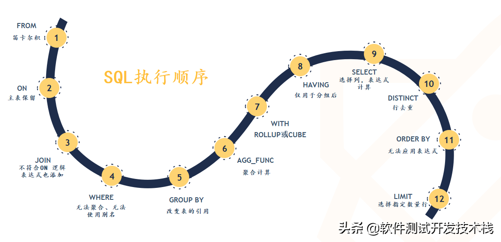

# MySQL执行顺序
+ 
+ 
### 注意事项
+ SQL执行的每一步，都会为下一步生成一个虚拟表
### 1. FROM 连接
+ 对SELECT语句进行查询的时候，首先会对FROM两边的表执行连接，会形成**笛卡尔积**，这时候会产生一个虚表VT1.
   - FROM子句执行顺序为从后往前、从右到左，FROM 子句中写在最后的表(基础表 driving table)将被最先处理，即最后的表为驱动表，当FROM 子句中包含多个表的情况下，我们需要选择数据最少的表作为基础表。
### 2. ON连接
+ 对虚拟表VT1 应用ON筛选器，ON 中的逻辑表达式将应用到虚拟表 VT1中的各个行，筛选出满足ON 逻辑表达式的行，生成虚拟表 VT2 
### 3. JOIN连接
+ 如果指定了OUTER JOIN保留表中未找到匹配的行将作为外部行添加到虚拟表 VT2，生成虚拟表 VT3。<**保留表**>如下：
   - LEFT OUTER JOIN把左表记为保留表
   - RIGHT OUTER JOIN把右表记为保留表
   - FULL OUTER JOIN把左右表都作为保留表
+ 在虚拟表 VT2表的基础上添加保留表中被过滤条件过滤掉的数据，非保留表中的数据被赋予NULL值，最后生成虚拟表 VT3（如果FROM子句包含两个以上的表，则对上一个联接生成的结果表和下一个表重复执行步骤1~3，直到处理完所有的表为止）  
### 4. WHERE 过滤
+ 对虚拟表 VT3应用WHERE筛选器。根据指定的条件对数据进行筛选，并把满足的数据插入虚拟表 VT4。注意
   1. 由于数据还没有分组，因此现在还不能在WHERE过滤器中使用聚合函数对分组统计的过滤。
   2. 同时，由于还没有进行列的选取操作，因此在SELECT中使用列的别名也是不被允许的。
 
### 5. GROUP BY 
+ 按GROUP BY子句中的列/列表将虚拟表 VT4中的行唯一的值组合成为一组，生成虚拟表VT5。如果应用了GROUP BY，那么后面的所有步骤都只能得到的虚拟表VT5的列或者是聚合函数（count、sum、avg等）。原因在于**最终**的结果集中只为**每个组保留一行**。
    1. 同时，从这一步开始，后面的语句中都可以使用SELECT中的别名。
###  6. AGG_FUNC 计算聚合函数
+ 计算 max 等聚合函数。SQL Aggregate 函数计算从列中取得的值，返回一个单一的值。常用的 Aggregate 函数包涵以下几种：
   1. AVG：返回平均值
   2. COUNT：返回行数
   3. FIRST：返回第一个记录的值
   4. LAST：返回最后一个记录的值
   5. MAX： 返回最大值
   6. MIN：返回最小值
   7. SUM： 返回总和  
### 7. WITH 应用ROLLUP或CUBE  
+ 对虚拟表 VT5应用ROLLUP或CUBE选项，生成虚拟表 VT6,CUBE 和 ROLLUP 区别如下：
    - CUBE 生成的结果数据集显示了所选列中值的所有组合的聚合
    - ROLLUP 生成的结果数据集显示了所选列中值的某一层次结构的聚合    
### 8. HAVING 
+ 对虚拟表VT6应用HAVING筛选器。根据指定的条件对数据进行筛选，并把满足的数据插入虚拟表VT7
   - HAVING 语句在SQL中的主要作用与WHERE语句作用是相同的，但是HAVING是过滤聚合值，在 SQL 中增加 HAVING 子句原因就是，WHERE 关键字无法与聚合函数一起使用，HAVING子句主要和GROUP BY子句配合使用
+ 在之前的认知当中，Group By会将数据分好组，即：分组之后只留一条数据,例如 group by a , 则保留一条记录a,重复的都丢失了，其他字段都是聚合信息,但是并不是这样，而仅仅是将group by 后面字段值相同的记录放在一起(就形成了一个个的组，见:(https://www.cnblogs.com/qlqwjy/p/7834571.html)，形成虚拟表。当应用having条件的时候，则会将having后面的条件应用到一个个的组上，查出数据，形成虚拟表，为下一步打好基础。 当一组有多条记录，且select 后有很多字段(不仅仅含有group by后面跟的字段)，这时候会查询到该组(经过Having的过滤,该组的数据是符合Having条件的)内主键(也有可能不是根据主键索引)最小的那一条数据
### 9. SELECT 
+ 将虚拟表 VT7中的在SELECT中出现的列筛选出来，并对字段进行处理，计算SELECT子句中的表达式，产生虚拟表 VT8。
### 10. DISTINCT
+ 将重复的行从虚拟表 VT8中移除，产生虚拟表 VT9。DISTINCT用来删除重复行，只保留唯一的。
### 11. ORDER BY 
+ 将虚拟表 VT9中的行按ORDER BY 子句中的列/列表排序，生成游标 VC10 ，注意不是虚拟表。因此使用 ORDER BY 子句查询不能应用于表达式。同时，ORDER BY子句的执行顺序为从左到右排序，是非常消耗资源的。
### 12. LIMIT/OFFSET 指定返回行
+ 从VC10的开始处选择指定数量行，生成虚拟表 VT11，并返回调用者。

## MySQL表类型
### 1. 永久表
+ 用于长期保存数据
### 2.  临时表
1. 类似于永久表，只保存临时数据，但是能够长久存在
2. 临时创建的，SQL语句执行完就会被删除
### 3. 虚表
+ 虚表其实就是视图