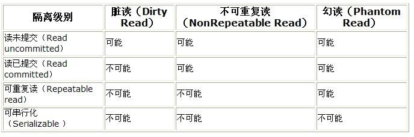

# MySQL的架构与历史
## MySQL架构
## MySQL事务
### 什么是事务
+ 事务就是一组原子性的SQL查询，或者说是一个独立的工作单元
+ 事务内的语句，要么全部执行成功，要么全部执行失败
### 事务的特性
+ A(atomicity):原子性，一个事务必须被视为是一个不可分割的最小工作单元，整个事务中所有的操作，要么全部执行成功，要么全部执行失败。即：永远不可能执行"一部分"
+ C(consistency):一致性，数据库总是从一个一致性状态转换到另外一个一致性状态。
+ I(isolation):隔离性，一个事务所做的修改在最终提交之前，对其他的事务是不可见的。
+ D(durability):持久性，一旦事务提交，则其所做的修改就会永久保存到数据库中。
### 事务的操作
+ 开始一个事务:start transaction / begin
+ 回滚:rollback
+ 提交:commit
### MySQL隔离级别
+ MySQL的隔离级别是由存储引擎来实现的(**SQL标准定义,由存储引擎来实现**)。每一种隔离级别都规定了一个事务中所做的修改，哪些事务内和事务间是可见的，哪些是不可见的。较低级别的隔离通常可以执行更高的并发，系统的开销也更低。
#### 隔离级别(排序：性能 高----> 低)
##### READ UNCOMMITTED(未提交读)
+ 事务中的修改，即使没有提交，对其他的事务也都是可见的，即:**脏读**
##### READ COMMITTED(提交读)
+ 一个事务从开始直到提交之前，所做的任何修改修改对于其他的事务都是不可见的.但是,在这个事务的隔离级别中，一个事务是可以读取其他事务已经提交的数据，故：这个隔离级别也称为:"不可重复读"
+ 这种隔离级别产生的问题并不致命，可以通过加锁来克服。
##### REPEATABLE READ(可重复读，MySQL默认的隔离级别)
+ 解决了脏读的问题。保证了在同一个事务中多次读取同样的记录的结果是一致的。
+ **幻读**：当某个事务在读取某一个范围内的记录时，另外一个事务又在该范围内插入了新的记录，当之前的事务再次读取该范围内的事务时，就会产生幻行。InnoDB存储引擎已经通过MVCC(多版本并发控制)解决了幻读的问题**注意，是在这个隔离级别下解决了**。
##### SERIALIZABLE(可串行化)
+ 最高的隔离级别。此隔离级别强制事务串行执行，避免了幻读问题。SETILIZABLE会在读取的每一行数据上加锁，所以可能会导致大量的锁争用和超时问题。
##### SQL隔离级别

# MySQL锁
## 详见第九章_锁.md