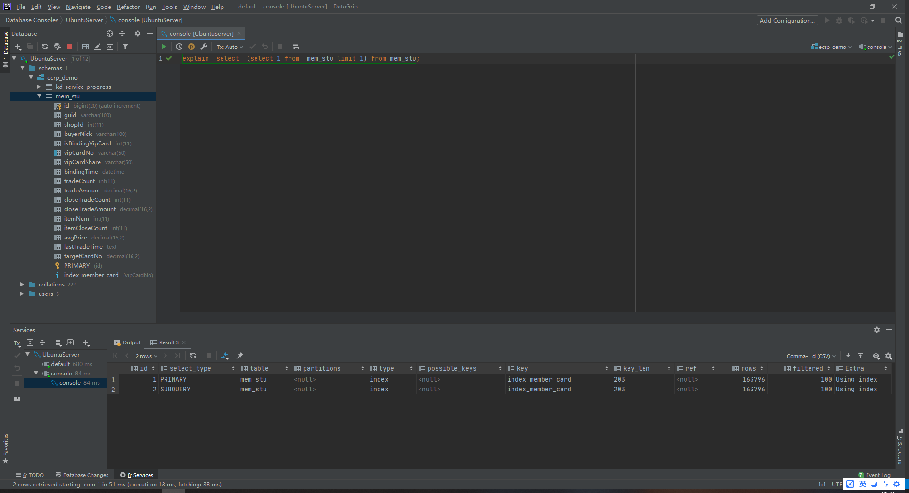
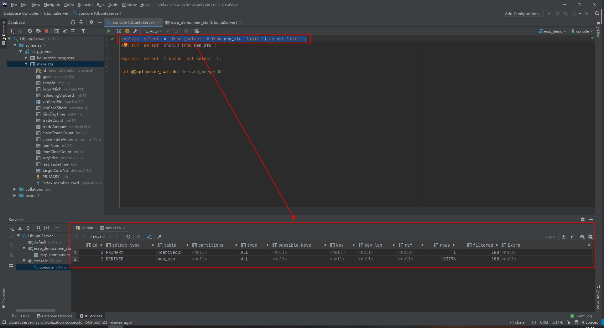
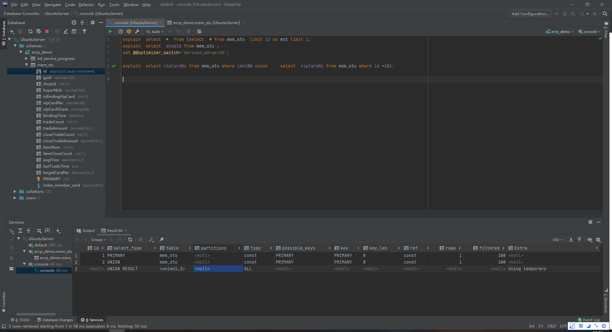
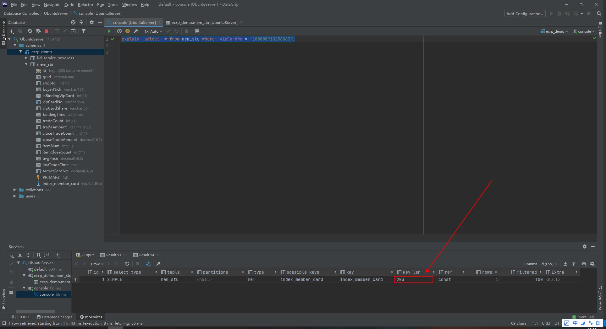

# Explain
## 功能
可以使用explain来获取关于**查询执行计划**的信息，即:explain命令是查看查询优化器如何决定执行查询的主要方法，这个功能存在局限性，并不总会说出真相，但是他的输出是可以获取的最好信息。
   + explain 仅仅能解释SELECT查询(高版本中也能支持其他的)，不能对存储过程，INSERT,UPDATE,DELETE以及其他的语句做解释
## 使用方式
要使用explain，则只需要在查询的select关键字之前添加EXPLAIN即可。但是，需要注意的是：
   1. MySQL会在查询上设置一个标记，当执行查询是，这个标记会使其**返回关于在查询计划中每一步的信息，而不是执行他**(不是真正执行)
   2. 他会返回一行或者多行信息，显示出执行计划中的每一部分和执行顺序。
   3. 在查询中，每个表在输出中只有一行。若：
        + 若查询的是两个表的联接，则输出中将有两行。
        + 别名表单算一个表，因此，若将一个表与自己联接，输出行中也会有两行。
        + 这里的表意义较广，可以是一个子查询，一个union结果等。
### 请注意
**认为增加EXPLAIN时MySQL不会执行查询，这是错误的**，如果查询在FROM子句中包括子查询，则MySQL实际上会执行子查询，将其结果放在一个临时表中，然后完成**外层查询优化**，他必须在可以完成外层查询优化之前处理掉所有类似的子查询，这对于EXPLAIN是必须要做的(可能会在高版本中去掉该限制)。
### EXPLAIN只是一个近似的结果，别无其他，有时候他是一个很好的近似，但在其他时候，可能与真相相差甚远。见如下限制：
  1. explain不会反馈触发器，存储过程或者UDF会如何影响查询
  2. 不支持存储过程，仅支持select操作
  3. 不会反馈MySQL在执行查询的时候所做的特定优化
  4. 不会反馈关于查询的执行计划的所有信息
  5. 不区分具有相同名字的事物。例如，他对内存排序和临时文件都使用filesort，并且对磁盘上和内存中的临时表都显示为Using Temporary
  6. 可能会误导。例如，对一个有着很小limit的查询显示为全索引扫描。

## EXPLAIN中的列
### id列
+ 这一列包含一个编号，标识SELECT所属的行。如果在语句中没有子查询或联合，那么只会有唯一的SELECT,于是每一行在这个列中都将显示一个1。否则，内层的SELECT语句一般会顺序编号，对应其在原始语句中的位置。
+ MySQL将SELECT分为简单和复杂类型，复杂类型可以分为三大类：
   1. 简单子查询
   2. 所谓的派生表(FROM中的子查询)
   3. UNION查询
##### 查询类型
###### 1. 简单子查询
+ 
###### 2. FROM子句中的子查询
+ 
+ 请注意
   1. 派生表（FROM子句中的子查询）可以在没有 grouping, aggregates, or ORDER BY ...  LIMIT 子句时合并到他们的父查询中(即在执行计划中不会出现DERIVED)。这个优化默认开启，可通过如下关闭：
       + [set @@optimizer_switch='derived_merge=OFF'](https://mariadb.com/kb/en/derived-table-merge-optimization/)
###### 3. UNION查询
+ 
+ 需要注意的是：
   1. **当使用union all的时候，则不会出现第3行(UNION RESULT)内容，具体原因暂不知晓**，待后续补充。这可能也是union all 性能高于union 的原因吧

## select_type列
这一列显示对应行是简单还是复杂的select。SIMPLE代表查询不包含子查询和union。如果查询有任何复杂的子部分，则最外层标记为PRIMARY,其他部分标记如下：
##### 标记：SUBQUERY
+ 包含在SELECT列表中的子查询中的SELECT标记为SUBQUERY
##### 标记：DERIVED
+ 表示包含在FROM子句的子查询中的SELECT,MySQL会递归执行并将结果放到一个临时表中。服务器内部称之为派生表，因为该临时表是从子查询中派生出来的。
##### 标记：UNION
+ 在UNION中的第二个和随后的SELECT被标记为UNION，第一个SELECT被标记为就好像以部分外查询来执行。这就是之前的例子中在UNION中的第一个SELECT显示为PRIMARY的原因。如果UNION被FROM子句中的子查询包含，那么他的第一个SELECT会被标记为DERIVED
##### 标记：UNION RESULT
+ 用来从UNION的匿名临时表中检索结果的SELECT被标记为UNION RESULT

## table列
这一列显示了对应行正在访问哪一个表(有时候显示的是表的别名)
## type列
访问类型----即MySQL决定如何查找表中的行。从最差到最优分别为:
##### ALL
+ 即全表扫描，意味着MySQL必须扫描整张表，从头到尾，去找到需要的行。
##### index
+ 这个和全表扫描一样，只是MySQL扫描表时按照索引的顺序进行而不是行。主要优点是避免了排序，最大的缺点是要承担按照索引顺序读取整张表的开销。
   - 如果在Extra列中看到Using Index，则说明MySQL使用了覆盖索引（**即回表查询**），他只扫描了索引的数据，而不是按照索引的顺序每一行。比按照索引顺序全表扫描的开销要少得多。
##### range
范围扫描就是有限制的索引扫描，他开始索引里的某一点，返回匹配这个值域的行。这比全索引扫描好一些，因为他不用遍历全部索引。   

##### ref
这是一种索引访问，他返回所有匹配某个单个值的行。然而，他可能找到多个符合条件的行，因此，他是查找和扫描的混合体。此类索引访问只有当使用非唯一索引或者唯一索引的非唯一前缀才会发生。

##### eq_ref
使用这种索引查询，MySQL知道最多只返回一条符合条件的记录。这种访问方法可以在MySQL中使用主键或者唯一性索引查找时看到。MySQL对这类访问类型的优化做的非常好，因为他知道无须估计匹配行的范围或在找到匹配行之后再继续查找。
##### const，system
当MySQL能对查询的某部分进行优化并将其转换为一个常量时，他就会使用这些访问类型。例如，通过将某一行的主键放入到where子句中的方式来选取此行的主键，MySQL就能把这个查询转换为一个常量。

##### NULL
这种访问方式意味着MySQL能在优化阶段分析查询语句，在执行阶段甚至用不着再访问表或者索引。

## possible_keys列
显示了查询可以使用哪些索引，但是这只是说可以使用，但不一定会使用
## key列
这一列显示了MySQL将会使用哪个索引来优化对该表的访问。
  + 即对于possible_keys列和key列，possible_keys列揭示了哪一个索引能有助于高效地查找，而key显示的是优化采用哪一个索引可以最小化查询成本。
## key_len列
该列显示了MySQL在索引里使用的**字节数**。如果MySQL正在使用的只是索引里的某些列，那么就可以使用这个值来计算出具体是那些列。
   - key_len计算需要注意：变长字段需要额外的2个字节，固定长度字段不需要额外的字节。而null都需要1个字节的额外空间，所以以前有个说法：索引字段最好不要为NULL，因为NULL让统计更加复杂，并且需要额外一个字节的存储空间。
   - ken_len显示了在索引字段中可能的最大长度，而不是表中数据使用的实际字节数。即ken_len通过查找表的定义而被计算出，而不是表中的数据。
   - 
       + member_card索引的长度:50 x 4(utf8mb4下一个字符所占字节数) + 2(变长类型的长度记录) + 1(允许为NULL的) = 203
## ref列
显示之前的表在key列的索引中查找值所用的列或者常量。
## row列
显示MySQL估计为了找到所需的行而需要读取的行数。
   - 这个数字是内嵌循环关联计划里的循环数目。也就是说他不是MySQL认为他最终需要从表里读取到的行数，而是MySQL为了找到符合查询的每一点上标准的那些行而必须读取的行的平均数。
   - 这个是MySQL认为他需要检查的行数，而不是结果集里的行数。
## filtered列
显示的是针对与表中符合某个条件（where子句或者连接条件）的记录数的百分比所做的一个悲观估算。如果将rows列和这个百分比相乘，就可以知道MySQL估算他和查询计划里前一个表关联的行数。
## Extra列
显示的是不适合在其他列显示的额外信息，重要的值有
##### 1. Using index
表示Mysql将使用覆盖索引，以避免访问表
##### 2. Using where
意味着MySQL服务器将在存储引擎检索行后在进行过滤。
##### 3. Using temporary
意味着MySQL在对查询结果排序是会使用到一个临时表。但不能区分是内存临时表还是磁盘临时表。
##### 4. Using filesort
意味着MySQL会对结果使用一个外部索引排序，而不是按照索引次序从表里读取行

## 注意事项
### 1. 当值索引中的字段的数据类型相同是，才能使用索引
+ 
     - 当值的类型与你传入的值的类型一致时候（字段类型为字符串，传入的值的类型也为字符串），使用了索引
+ 
     - 当值的类型与你传入的值的类型不一致时候（字段类型为字符串，传入的值的类型为数字类型），索引失效