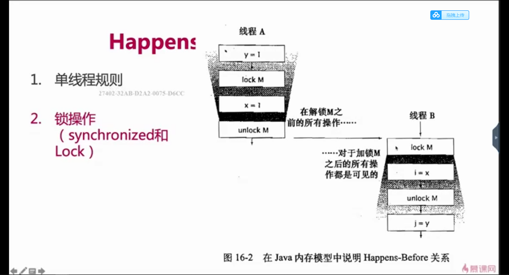

# java内存模型与线程
## 背景
  + 让计算机同时去做几件使用，不仅是计算机的算力提升了，还有一个原因:计算机的运算速度与它的存储和通信子系统的速度的差距太大。大量的时间都花费在磁盘I/O、网络通信或者数据库访问之上。如果不想处理器在大部分的时间里都处于等待其他资源的状态，就必须使用一些手段将处理器的运算能力压榨出来。
       - 进程在等待I/O，网络通信或者是访问数据库的时候，内核及时进行进程的调度，将那些不在等待io，网络通信，数据库访问的且需要cpu运算的进程进行调度，让它们去运行。当之前的进程的I/O，网络通信，数据库访问完成之后，内核及时将它们调度回来，进行余下的运算。这就会大大提高cpu的运算效率。
## 针对硬件效率的优化
- 高速缓存
  + 计算机的存储设备与处理器的运算速度有几个数量级别的差距，所以现代计算机在处理器和内存加入一层读写速度尽可能接近于处理器运算速度的高速缓存作为缓冲。--将运算需要使用到的数据复制到缓存中，让运算能快速进行;当运算结束后再从缓存中同步到主存之中;这样处理器就无需等待缓慢的内存读写了。
  + 缺点:
     1. 这会导致缓存不一致的问题(缓存一致性)
- 乱序执行(**指令重排**)
  + 为了是处理器内部的运算单元能够尽量被充分利用，处理器可能会对输入的代码进行乱虚执行优化。处理器会在处理之后将乱序执行的结果重组，保证该结果与顺序执行的结果一致
  + Java虚拟机的及时编译器中也有类似的指令重排优化
- 计算机级别的内存模型
   + <div> </div>

## Jvm内存结构 && Java对象模型 && Java 内存模型
### Jvm内存结构
+ 和java虚拟机的运行区域有关，例如 堆，栈。。。
+ 如图
   - 
### Java对象模型
+ 和java对象在jvm中的表现形式,即java对象自身的存储模型
+ 如图:
   - 
### Java 内存模型
#### 模型图
+ 图一
     -  

+ 图二 
     - 
#### 为什么需要JMM
1. C语言不存在内存模型的概念
2. 依赖于处理器，不同处理器结果不一样
    - CPU有多级缓存，导致读的数据过期
       + 高速缓存的容量比主存小，但是速度仅次于寄存器，所以cpu和主存之间就多了cache层
       + cpu缓存图 
3. 无法保证并发安全
4. 需要一个标准，让多线程运行的结果可以预期
#### 什么是JMM
+ 和java的并发编程有关
+ JMM是一种规范(确保在不同的jvm上有相同的效果，即标准的规范，自定义的实现)
+ 工具类和关键字的原理
   - volatile
   - synchronized
   - Lock
#### 重排序
+ 好处:提高处理速度,减少需要执行的指令
   - 
   - 如图，CPU指令优化之后，需要执行的指令数减少了
##### 重排的地方
1. 编译器优化，包括jvm，jit编译器等
2. CPU指令重排，即使编译器不发生重排，CPU也可能对指令进行重排
3. 内存的"重排序"：线程A的修改线程B却看不到，引出可见性问题
#### 代码示例
+ 如下代码x,y的值的情况右四种结果
    1. (x,y) => (0,1){a =1;x=b;b=1;y=a}
    2. (x,y) => (1,0){b=1;y=a;a=1;x=b;}
    3. (x,y) => (1,1){a=1;b=1;x=b;y=a;}
    ----------
    **以上三种情况考虑的是每个线程的代码是按照顺序执行的**
    ----------
    4. (x,y) => (0,0) {y=a;a=1;x=b;b=1;}
```java
  import java.util.concurrent.CountDownLatch;

     /**
     * 重排序
     */
     public class OutOfOrderExecution {
     private static int a = 0, b = 0;
     private static int x = 0, y = 0;

     public static void main(String[] args) throws InterruptedException {
          CountDownLatch countDownLatch = new CountDownLatch(1);
          int i = 0;
          for (; ; ) {

               i++;
               a = 0;
               b = 0;
               x = 0;
               y = 0;

               Thread one = new Thread(new Runnable() {
                    @Override
                    public void run() {
                         try {
                         countDownLatch.await();
                         } catch (InterruptedException e) {
                         e.printStackTrace();
                         }
                         a = 1;
                         x = b;
                    }
               });

               Thread two = new Thread(new Runnable() {
                    @Override
                    public void run() {
                         try {
                         countDownLatch.await();
                         } catch (InterruptedException e) {
                         e.printStackTrace();
                         }
                         b = 1;
                         y = a;
                    }
               });

               one.start();
               two.start();
               countDownLatch.countDown();

               one.join();
               two.join();


               String result = "第" + i + "次 --- (x.y) = (" + x + "," + y + ")";
               System.out.println(result);
               if (x == 1 && y == 1) {
                    break;
               }

          }


     }
     }
```
#### 可见性
##### 示例代码
+ 可能出现的结果
   1. a=3  , b= 3
   2. a=3 , b= 1
   3. a=1 , b=2
   ---------
   4. a = 1  , b = 3  // b同步到了主存，a还没有同步到主存
+ 示例代码
```java
/**
 * 可见性
 */
public class FieldVidibility {

    private int a = 1;
    private int b = 2;

    public void change() {
        a = 3;
        b = a;
    }

    public void print() {
        System.out.println("a = " + a + "; b = " + b);
    }

    public static void main(String[] args) {
        while (true) {
            FieldVidibility fieldVidibility = new FieldVidibility();

            Thread one = new Thread(new Runnable() {
                @Override
                public void run() {
                    try {
                        Thread.sleep(100);
                    } catch (InterruptedException e) {
                        e.printStackTrace();
                    }

                    fieldVidibility.change();
                }
            });

            Thread two = new Thread(new Runnable() {
                @Override
                public void run() {
                    try {
                        Thread.sleep(100);
                    } catch (InterruptedException e) {
                        e.printStackTrace();
                    }

                    fieldVidibility.print();
                }
            });

            one.start();
            two.start();
        }

    }

}
```
##### 为什么会有可见性问题
1. CPU有多级缓存，导致读的数据过期
   +  高速缓存的容量比主存小，但是速度仅次于寄存器，所以cpu和主存之间就多了cache层
   + 线程间对共享变量的可见性问题不是直接由多核引起的，而是由多级缓存引起的
##### JMM主内存和本地内存(工作内存)
+ 这里的本地内存并不是一个真实的内存，而是一个抽象。是对寄存器，一级缓存，二级缓存等的抽象
###### 主内存和本地内存关系
1. 所有的变量都存储在主内存之中，同时每个线程也有自己独立的工作内存，工作内存中的变量内容是主内存中的**拷贝**
2. 线程不能直接读写主内存中的变量，而是只能操作自己工作内存中的变量，然后在同步到主内存中去
3. 主内存是多个线程共享的，但线程间不共享工作内存，若线程间需要通信，必须借助主内存中转来完成
4. 总结: 所有的共享变量都存在主存之中，每个线程有自己的本地内存，而且线程读写共享数据也是通过本地内存交换的，这个交换并不是实时的，所以才导致了可见性问题

#### Happens - before 规则
1. 单线程原则 
   + 在同一个线程内部，不论该线程内部是否发生重排序，后面的代码一定能够看到前面的代码的执行效果
2. 锁操作原则
   + 解锁之前的代码执行效果对于加锁之后的代码都是可见的
   + 
3. volatile变量
   + 只要这个变量被volatile修饰，线程A对这个变量修改了，那么线程B就立马可以看得到(内存屏障)
4. 线程启动
   + 子线程所有语句都能看到线程启动前父线程代码的执行结果 
5. 线程join
   + 一旦join之后，join之后的代码可以看到join之前代码的执行结果
6. 传递性
   + 若hb(a,b) 而且 hb(b,c) 则可以推出 hb(a,c)
     - 即 第一行代码的执行结果第二行代码可以看到，第二行代码的执行结果第三行代码可以看到。则第一行代码的执行结果第三行代码可以看到
7. 中断
   + 一个线程被其他线程interrupt时，那么检测中断(isInterrupt)或抛出InterruptedException一定能看到
8. 工具类的happens - before
    + 线程安全的容器get一定可以看到在此之前的put等存入操作
    + CountDownLatch
    + Semaphore
    + Future
    + 线程池
    + CyclicBarrier
#### Volatile 关键字