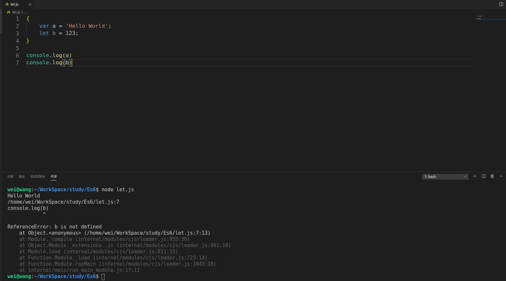

# let & const 命令
## 01. let 命令
+ 功能： 用于声明变量，用法类似与var，但是let所声明的变量只在let命令所在的代码块内有效。
   - 即：let命令声明的变量拥有**块级作用域**，注意，let声明的变量有块级作用域了
   - 代码展示：
   ```js
   {
       var a = 'Hello World';
       let b = 123;
   }
   console.log(a); // 输出Hello World
   console.log(b); // b is not defined
   ```
   - 
### 在for循环中使用let是比较适合的
+ 代码演示:
    ```js
        // for循环搭配var使用
        for (var indexVar = 0; indexVar < 9; indexVar++) {
            console.log('var for循环:' + indexVar)
        }

        // 打印indexVar变量的值
        console.log('indexVar:' + indexVar)


        // for循环搭配let使用
        for (let indexLet = 0; indexLet < 9; indexLet++) {
            console.log('let for循环:' + indexLet)
        }
        // 打印indexLet变量的值
        console.log('indexLet : ' + indexLet)

        // 输出:
        /*
        wei@wang:~/WorkSpace/study/Es6$ node let.js 
        var for循环:0
        var for循环:1
        var for循环:2
        var for循环:3
        var for循环:4
        var for循环:5
        var for循环:6
        var for循环:7
        var for循环:8
        indexVar:9
        let for循环:0
        let for循环:1
        let for循环:2
        let for循环:3
        let for循环:4
        let for循环:5
        let for循环:6
        let for循环:7
        let for循环:8
        /home/wei/WorkSpace/study/Es6/let.js:15
        console.log('indexLet : ' + indexLet)
                                    ^

        ReferenceError: indexLet is not defined
            at Object.<anonymous> (/home/wei/WorkSpace/study/Es6/let.js:15:29)
            at Module._compile (internal/modules/cjs/loader.js:955:30)
            at Object.Module._extensions..js (internal/modules/cjs/loader.js:991:10)
            at Module.load (internal/modules/cjs/loader.js:811:32)
            at Function.Module._load (internal/modules/cjs/loader.js:723:14)
            at Function.Module.runMain (internal/modules/cjs/loader.js:1043:10)
            at internal/main/run_main_module.js:17:11 */
    ```
    + 即，let声明的变量是有块级作用域的，当到了for循环的作用域之外，let声明的变量就失效了。
### 如何理解index和index2的值
#### 代码一，var配合for使用，a[6]()会输出什么?
    ```javascript
        var a = [];
        for (var index = 0; index < 10; index++) {
            a[index] = function () {
                console.log(index);
            };
        }

        a[6]() // 输出10
        console.log(a[6].toString())/* 输出
        function () {
            console.log(index);
        }
        */
    ```
+ 为什么a\[6\]()会输出10？
  - 因为index是由var声明的，在全局范围内都有效，所以全局只有一个变量index。每一次循环，变量index的值都会发生改变，而在循环内部，被赋值给数组a的函数内的console.log(index)中的index是指向全局的index。即数组a中所有成员中的index都是同一个index，导致运行时输出的是最后一轮index的值，也就是10
#### 代码二，let配合for使用，b[6]()会输出什么？
```javascript
    var b = [];
    for (let index2 = 0; index2 < 10; index2++) {
        b[index2] = function () {
            console.log(index2)
        };
    }

    b[6]() // 6
    b[5]() // 5
    console.log(b[6].toString()) /*
        function () {
            console.log(index2)
        }
    */
```
+ 为什么b\[6\]()会输出6？
  - 变量index2是由let声明的，当前的index2仅在本循环内有效，所以每一次循环的index2都是一个新的变量，于是最后输出的是6.因为每一次循环中的index2都是重新声明的，那么js如何知道上一次循环的值且计算出本循环的值呢？这依赖于JavaScript引擎，JS引擎会记住上一次循环的值，初始化本轮的变量index2时，就在上一轮循环的基础上进行计算。
     - 即：a数组中每一个元素中的console.log(index2)中的index2都是不同的，是每一次循环新声明的变量，故执行每一个函数(数组a的每一个成员)所输出的值是不一样的
### for循环中的父子作用域
+ 如下代码
```javascript
   for(let index = 0;index <3;index++){
    let index = 'abc';
    console.log(index)
   }
 // 输出结果1: 输出三次 'abc'
 //------------------------------------------
    for(let index1 = 0;index1 <3;index1++){
        console.log(index1)
    }
    // 输出结果2: 输出 0 1 2 

  //-------------------
    function print(num) {
        console.log(num);
        return true;
    }
    for (let index1 = 0; index1 < 3 && print(i); index1++) {
        let i = 0;
        console.log(index1);
    }
    /* 输出结果3：/home/wei/WorkSpace/study/Es6/let2.js:14
   for (let index1 = 0; index1 < 3 && print(i); index1++) {
                                         ^
    ReferenceError: i is not defined
        at Object.<anonymous> (/home/wei/WorkSpace/study/Es6/let2.js:14:42) */
```
   - 由输出结果1可以得知，console.log(index)中的变量index与for循环中的循环变量index不在同一个作用域不，而是有各自单独的作用域
   - 由输出结果2得知，在for循环中，子作用域可以访问父作用域中的变量
   - 由输出结果三得知，for循环中，父作用域不能访问子作用域内的变量