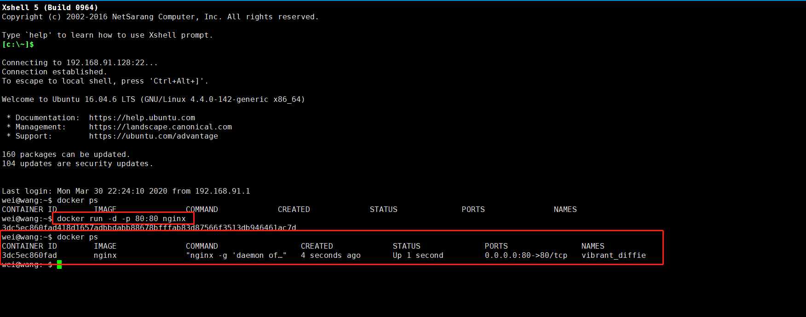
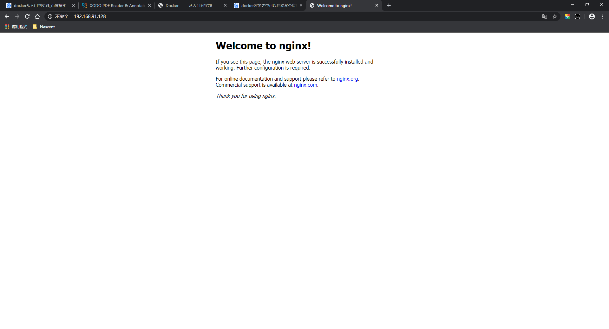
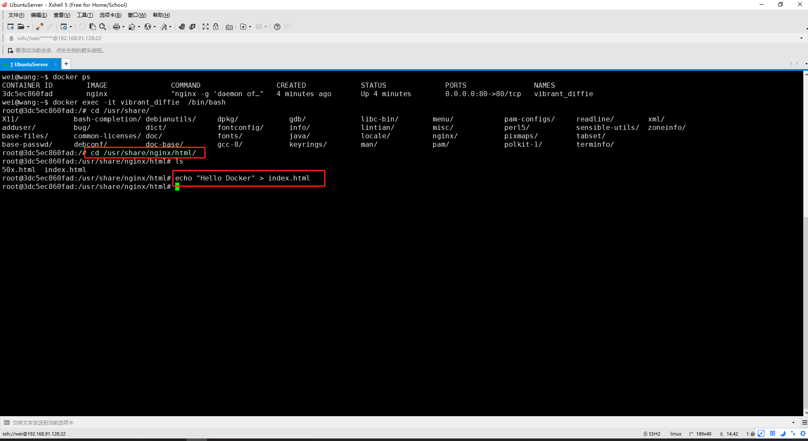
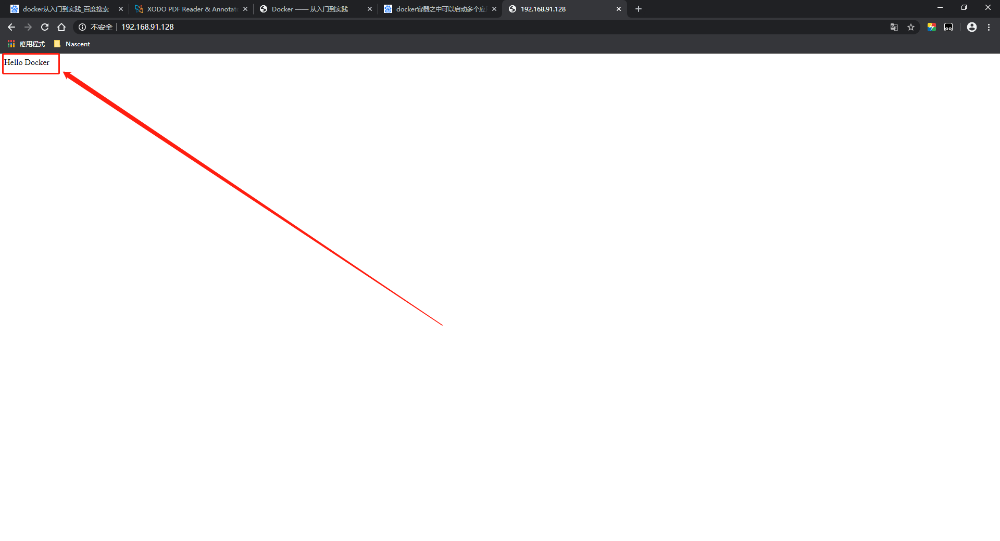
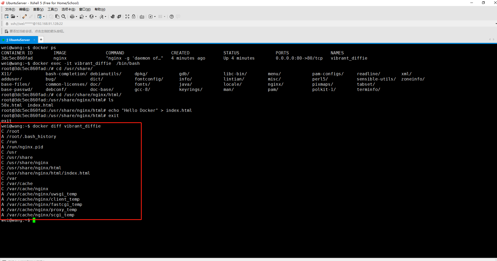
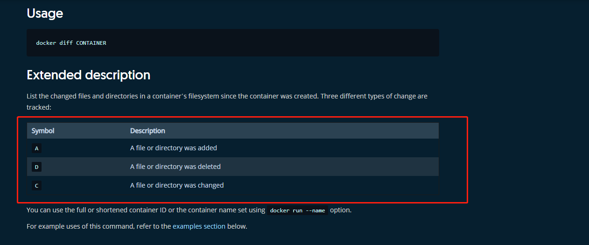
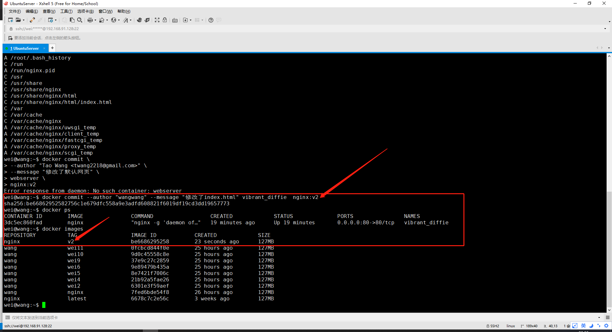
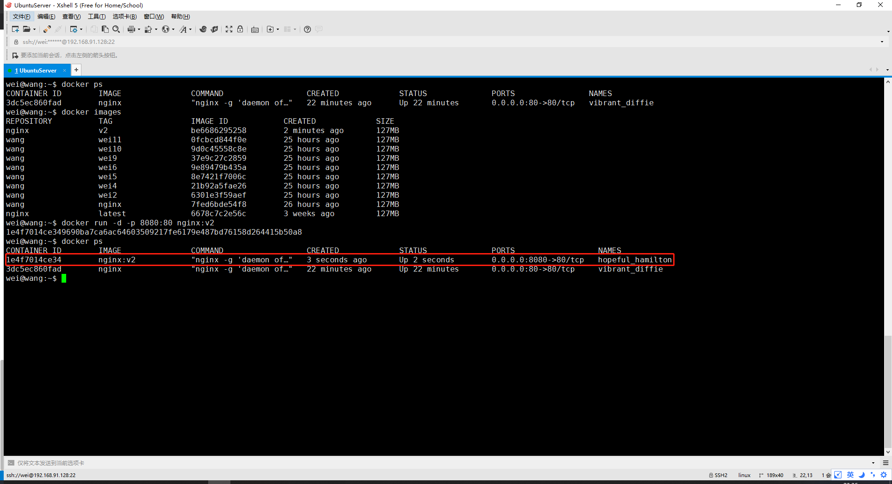
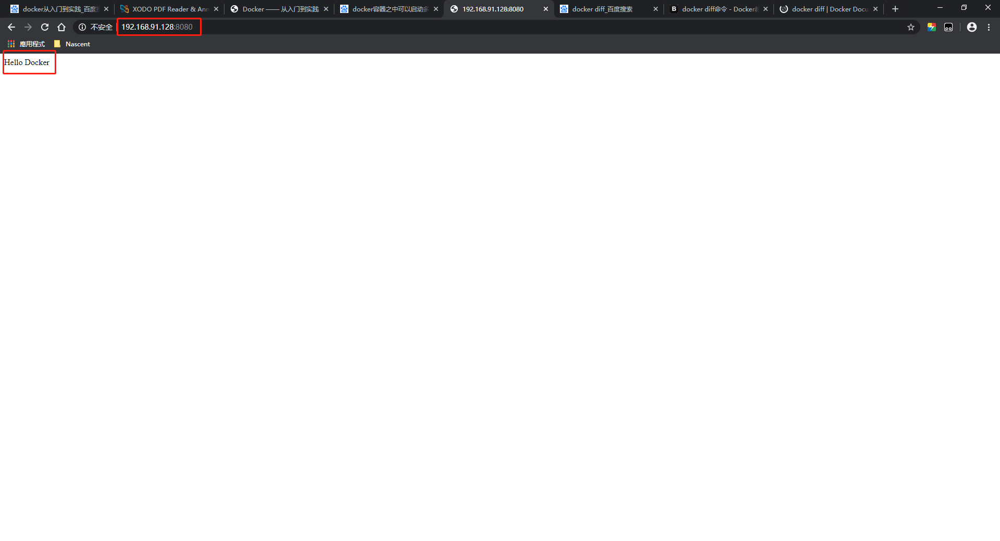

# Docker Commit 
##  1.docker commit命令的作用
  1. 定制镜像（不建议）
  2. 特殊场合的应用。如入侵后保存现场等
## 2.利用docker commit来理解镜像的构成
+ 镜像是容器的基础！(在使用Dockerfile定制镜像就会有体现---Dockerfile文件第一行必须为FROM指令)每次执行docker run命令都会指定哪个镜像作为容器运行的基础。当一些镜像不满足需求的时候，就需要定制这些镜像。
+ **回顾一下:** 镜像是多层存储，每一层都是在前一层的基础上进行的修改，且镜像在构建完成之后是不会改变的，后一层上发生的任何改变都只会影响到这一层。而容器同样也是多层存储，是在以镜像为基础层，在其基础上加上一层（容器存储层）作为容器的存储层
### 2.1使用一个例子来讲解镜像是如何构建的
#### 2.1.1 使用nginx作为基础镜像，启动一个名为nginxServer的容器

#### 2.1.2 访问一下

#### 2.1.3 以交互的方式进入到容器内部，修改index.html文件并重新访问

-------------

+ 我们改动了容器的文件，也就是改动了容器的存储层。

#### 2.1.4  使用docker diff命令查看容器存储层的修改

+ [A、C代表什么](https://docs.docker.com/engine/reference/commandline/diff/)

#### 2.1.5  保存为镜像
+ 现在，我们定制好了镜像之后，希望将其保存下来形成镜像。
+ 注意：
   1. 当运行一个容器的使用（**不使用卷的情况下**），我们做的任何文件的修改都会被记录容器的存储层中。而Docker提供了一个docker commit命令，可以将容器里的存储层保存下来成为镜像。即，在原有镜像的基础上，再叠加上容器的存储层并构成新的镜像。**以后我们在运行这个新镜像的时候，就会拥有原容器最后的文件变化**
+ 命令：docker commit --author "wangwang" --message "修改了index.html" vibrant_diffie  nginx:v2

#### 2.1.6 使用docker commit定制的镜像来创建容器，并访问
 + 
 + 

+ 我们发现，该新容器的状态和之前容器的最后状态一致。

### 3. 请慎用docker commit 
+  使用docker commit命令虽然可以比较直观的理解镜像分层存储的概念，但是实际环境中不要这样使用，应当使用Dockerfile文件来定制镜像。为什么？
   1. 细管之前docker diff的结果，你会发现，除了真正想要修改的/usr/share/nginx/html/index.html文件之外，由于命令的执行，还有很多的文件被改动或者添加。这还仅仅是简单的操作，如果是安装软件包，编译构建那会由大量的内容被添加进来，如果不小心清理，会导致镜像极为臃肿
   2. 使用docker commit来定制镜像相当于是黑箱操作，生成的镜像也被称为黑箱镜像。即：除了镜像的制作人之外，没有人知道制作该镜像时使用了什么命令，如何生成的镜像。
   3. 回顾之前的分层存储的概念，除当前层之外，之前的没一层都是**不会**发生改变的。即：任何的修改的结果仅仅是在当前层进行标记、添加、修改，而不会改动上一层。即存在的逻辑删除会导致所删除的上一层的东西不会丢失，而是一直跟随该镜像，即使无法访问这些文件，从而最终导致的严重后果就是：镜像太过于臃肿。