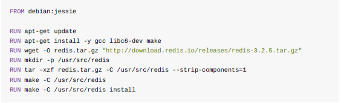
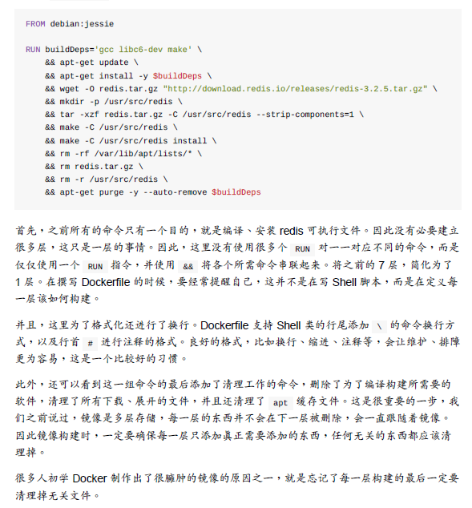

# Dockerfile构建镜像
## 为什么使用Dockerfile来构建镜像
+ 镜像的制作其实就是定制每一层所需要添加的配置、文件。如果可以将每一层的修改、安装、构建、操作的命令都写入到一个脚本之中，用这个脚本来构建、定制镜像，那么之前的无法重复的问题、镜像构建透明性的问题、体积的问题都会被解决。
## Dockerfile是什么？
+ Dockerfile是一个文本文件，其内包含了一条条的指令。**每一条指令构建一层，因此每一条指令的内容，就是描述该层当如何构建**
   - 请注意：每一条Dockerfile指令都会构建一层，也就是说，每次执行一条Dockerfile指令，该定制的镜像就会增加一层。又因为镜像的操作只会改变当前层，不会改变上一层的镜像。因此，在使用Dockerfile指令的时候，应该将尽量多的操作放到一个Dockerfile指令中执行(或者这样理解：将定制目标镜像所设计到的操作尽可能使用少的Dockerfile指令来完成，从而避免使用多个Dockerfile指令从而造成了镜像被构建了多层（虽然最后运行起来的效果一样），以至于该定制的镜像庞大)。
       + 例如，构建redis镜像，涉及到安装gcc环境 -> 下载redis源码 -> 解压 -> 编译 -> 删除源码包 -> 删除依赖等。如果将这每一个操作都使用一条Dockerfile指令来进行，这会导致该镜像存在多层（不必要的）。如下图：
         
       + 也因为每一条Dockerfile指令会构建一层镜像，且在每一层上的任何改变都只会发生在自己这一层。即此时就要考虑尽可能将多的操作放到一条Dockerfile指令中执行。如下
          
## Dockerfile指令
### 1.FROM
+ 所谓的定制镜像，那一定是以某一个镜像为基础，在其上进行定制。FROM就是指定基础镜像，因此一个Dockerfile文件中FROM是必备的指令，且必须是第一条指令。
+ Docker Store中有很多的官方镜像，有些可以直接拿来使用；有些方便开发、构建、运行各种语言应用的镜像，如openjdk等。可以在其中寻找一个最符合我们最终目标的镜像为基础进行定制。
+ 若，没有找到对应服务的镜像，官方镜像中还提供了一些更为基础的操作系统镜像，如ubuntu、centos等
+ 特殊的scratch镜像，该镜像是一个虚拟的概念，并不实际存在，他表示一个空白的镜像。
### 2. RUN
+ RUN指令是用来执行命令行命令的。其格式有两种：
  1. shell格式：RUN <命令> ，就像直接在命令行中输入的命令一样。如：
      - RUN echo "\<h1\>Helo DOcker \</h1\>"  > /usr/share/nginx/html/index.html
  2. exec格式：RUN["可执行文件"，“参数1”,"参数2"] 这就像函数的调用方式
+ **Dockerfile中每一个指令都会新建一层**（之前有提到）。RUN也不例外，也就是说我们不能像shell脚本那样将每一个命令对应一个RUN(**请注意：这不是在写shell脚本**)。如下
  ```yml
    FROM debian:jessie
    RUN apt-get update
    RUN apt-get install -y gcc libc6-dev make
    RUN wget -O redis.tar.gz "http://download.redis.io/releases/redis-3.2.5.tar.gz"
    RUN mkdir -p /usr/src/redis
    RUN tar -xzf redis.tar.gz -C /usr/src/redis --strip-components=1
    RUN make -C /usr/src/redis
    RUN make -C /usr/src/redis install
    # 这种方式是不建议的，这样使用RUN指令会创建7层镜像。
  ```
  + 如下，建议使用的方式：如上，该镜像的目的是通过源码包来编译安装Redis可执行文件，因此没有必要构建很多层，这只是一层的事情。因此这里没有必要使用多个RUN命令来一一对应不同的shell命令，而是使用一个RUN指令，使用&&符号将各个所需要的命令串联起来。将之前的7层，转换为现在的一层。请注意:写Dockerfile不是写shell脚本。如下：
  ```yml
  FROM debian:jessie
  RUN buildDeps='gcc libc6-dev make' \
    && apt-get update \
    && apt-get install -y $buildDeps \
    && wget -O redis.tar.gz "http://download.redis.io/releases/redis-3.2.5.tar.gz" \
    && mkdir -p /usr/src/redis \
    && tar -xzf redis.tar.gz -C /usr/src/redis --strip-components=1 \
    && make -C /usr/src/redis \
    && make -C /usr/src/redis install \
    && rm -rf /var/lib/apt/lists/* \
    && rm redis.tar.gz \
    && rm -r /usr/src/redis \
    && apt-get purge -y --auto-remove $buildDeps

    # 将所有的操作使用一个RUN指令来完成，且在最后清理掉了无用的文件，依赖，这会减少该镜像的大小。

    ## 其实这样更符合如下的特性：
       ### 镜像是多层存储，且镜像在构建完之后是不会被改变的，且每一个操作都只会影响到这一层，不会影响到上层镜像。故：在镜像构建的时候，一定要确保每一层只添加真正需要添加的东西，任何无关的东西都应该被清理掉。
  ```

## 构建镜像
  + 构建镜像需要使用docker build命令，具体使用方式为:
     - docker build [选项] <构建上下文路径>
     - 例如：docker build -f ./Dockerfile -t wang:wei  . (最后的点不能去掉，代表构建上下文)

### 什么是构建上下文？
#### Docker的架构
+ Docker是基于C/S来设计的。Docker在运行时分为
  1. Docker引擎(服务端守护进程)
  2. 客户端工具
Docker的引擎提供了一组REST API与Docker引擎进行交互，从而完成各种功能。因此，**我们在本机上执行各种docker功能，但实际上都是使用远程调用的形式在服务端完成**
+ 当进行镜像构建的时候，并非所有的定制行为都会通过RUN指令来完成，经常会需要将一些本地文件复制到镜像里面，如COPY、ADD等。而**docker build命令构建镜像，他的构建并不是在本地进行，而是在服务端，由docker引擎来构建**，那么，在C/S架构中，如何让服务端获取本地文件呢？
   - 这就涉及到了**上下文**的概念，在构建的时候，用户会指定镜像上下文的路径，docker build命令得知到该路径之后，会将路径下所有的内容打包，然后上传给docker引擎。这样，docker引擎收到这个上下文后，展开就会获得构建镜像所需要的一切文件。
   - 例如： COPY ./package.json /app/  
       + 这并不是复制执行docker build命令目录下的package.json文件，也不是复制Dockerfile所在目录下的package.json文件。而是复制上下文目录下的package.json中。
+ 基于上一点，docker build命令在构建的时候，会将上下文内的文件进行打包，发送到docker 引擎中进行镜像的构建。这涉及到一个问题：在上下文路径下，存在很多的文件不需要进行打包的时候，这会导致在打包的时候打包很多对构建镜像无用的文件(例如：在上下文目录中，我只需要将文件A拷贝到镜像中去，但是该目录下还存在文件B，10GB，是不需要参与镜像的构建的，该种情况下，若对文件B进行打包，会耗去很长时间，那该如何处理呢？)
   1. 要么，将Dockerfile文件和参与镜像构建的文件放到一个空的目录下面，该目录下面仅包含参与构建镜像的文件。
   2. 若上下文中有些东西确实不希望在构建的时候打包给到docker 引擎，则可以使用.gitignore一样的语法写一个.dockerignore文件，该文件用于剔除不需要作为上下文传递给docker引擎。