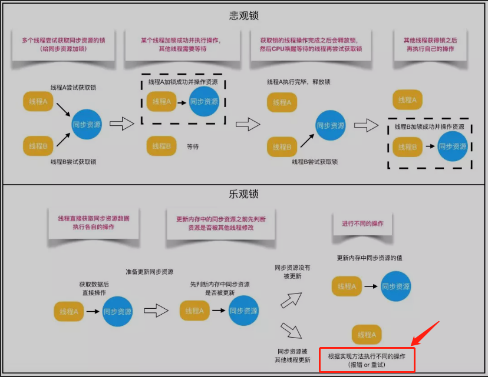
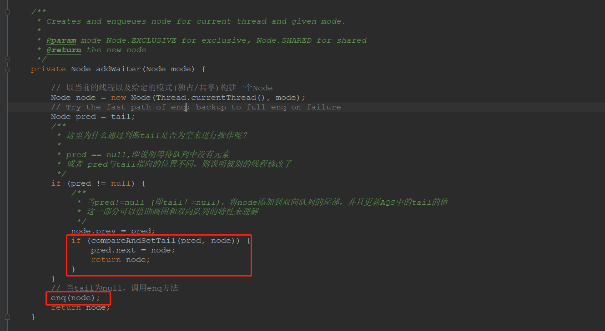
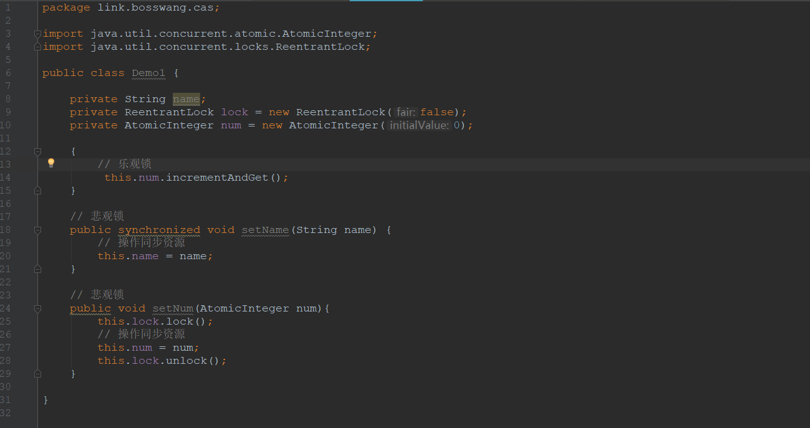
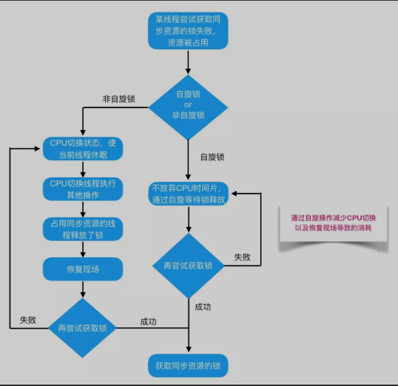

# Java之锁
+ Java提供了种类丰富的锁，每种锁根据其特性的不同，在适当的场景下能够展现出非常高的效率。（基于openjdk8）
##　锁的分类
### 01. 线程要不要锁住同步资源
1. 锁住
   + 悲观锁
2. 不锁住
   + 乐观锁
### 02. 锁住同步资源，线程要不要阻塞
1. 阻塞
2. 不阻塞
   + 自旋锁
   + 适应性自旋锁
### 03. 多个线程竞争同步资源的流程细节有没有区别
1. 不锁住资源，多个线程只有一个能修改资源成功，其他线程会重试
   + 无锁
2. 同一个线程执行同步资源时自动获取资源
   + 偏向锁
3. 多个线程竞争同步资源时，没有获取资源的线程自旋等待锁释放
   + 轻量级锁
4. 多个线程竞争同步资源时，没有获取资源的线程阻塞等待唤醒
   + 重量级锁
### 04. 多个线程竞争锁时要不要排队
1. 排队
   + 公平锁
2. 先尝试插队，插队失败再排队
   + 非公平锁
### 05. 一个线程中的多个流程能不能获取同一把锁
1. 可以
   + 可重入锁
2. 不能
   + 非可重入锁
### 06. 多个线程能不能共享一把锁
1. 能
   + 共享锁
2. 不能
   + 排他锁
## 锁的分析
### 乐观锁 && 悲观锁


1. 什么是悲观锁
   + 对于同一个数据的并发操作，悲观锁认为自己在使用数据的时候一定会有别的线程来修改数据，因此在获取数据的时候会先加锁，确保数据不会被别的线程修改。
      - Java中，synchronized关键字和Lock的实现类都是悲观锁
2. 什么是乐观锁
   + 乐观锁认为自己在使用数据是不会有别的线程来修改数据，所以不会添加锁，只实在更新数据的时候去判断之前有没有别的线程更新了这个数据。
      - 若这个数据没有被更新，则当前线程将自己修改的数据成功写入
      - **若数据已经被其他线程更新，则根据不同的实现方式执行不同的操作**(例如报错或者重试)。关键点是在数据被其他线程更新时根据不同的实现方式执行不同的操作。
         + 
         + 当尾节点设置失败，即尾节点数据被其他线程修改，这里是调用enq方法，将该节点入队。而在enq方法里面使用了乐观锁和自旋锁(详情参见源码)，来保证节点能够入队。
####　乐观锁 && 悲观锁适用场景
1. 悲观锁适合适用于写操作较多的场景，先加锁可以保证写操作时数据正确
2. 乐观锁适合读操作多的场景，不加锁的特点能够使其读操作的性能大幅度提升
3. 调用方式

#### 乐观锁的原理是什么，为什么乐观锁能够做到不锁定同步资源也可以正确实现线程同步。这里主要介绍一些乐观锁的实现方式：CAS技术
1. 什么是CAS
cas全称Compare And Swap（比较与交换），是一种无锁算法。在不使用锁(没有线程阻塞)的情况下实现多线程之间的变量同步。java.util.concurrent包下的原子类就是通过CAS来实现了乐观锁。
2. CAS算法设计到三个操作数
   + 需要读写的内存值V(即：需要读写的变量的内存地址)
   + 进行比较的值A
   + 要写入的新值B
3. CAS算法
   + 算法：当且仅当V的值等于A时，CAS通过原子方式用新的值来更新V的值(**比较+更新整体是一个原子操作**)，否则不会执行任何操作。一般情况下，更新是一个不断重试的操作
4. 通过AtomicInteger类来分析CAS
   1. AtomicInteger.java中的incrementAndGet方法。用于将数字加一
    ```java
         private static final Unsafe unsafe = Unsafe.getUnsafe();
         private static final long valueOffset;

         static {
            try {
                  /**
                  * 获取value属性在AtomicINteger中的偏移量
                  */
                  valueOffset = unsafe.objectFieldOffset
                        (AtomicInteger.class.getDeclaredField("value"));
            } catch (Exception ex) {
                  throw new Error(ex);
            }
         }

         /**
         * 存储AtomicInteger的int值，该属性需要借助volatile关键字保证其在线程件是可见的
         */
         private volatile int value;
         // ................................
         /**
         * Atomically increments by one the current value.
         *
         * @return the updated value
         */
         public final int incrementAndGet() {
            // 注意，这里的返回值。在getAndAddInt的返回值基础上+1
            return unsafe.getAndAddInt(this, valueOffset, 1) + 1;
         }
         // 可以发现，该方法调用了unsafe类的getAndAddInt方法
   ```
   2. UnSafe.java中的getAndAdInt方法
   ```java
      /**
      * Atomically adds the given value to the current value of a field
      * or array element within the given object <code>o</code>
      * at the given <code>offset</code>.
      *
      * @param o object/array to update the field/element in
      * @param offset field/element offset
      * @param delta the value to add
      * @return the previous value
      * @since 1.8
      * 根据OpenJdk8源码可以得出，getAndAddInt循环获取给定对象o中的偏移量处的值v，然后判断内存中值是否等于v。若相等，则内存值设置为v+delta,否则返回false。继续循环进行重试，直到设置成功才能退出循环，并且将旧值返回。整个“比较+更新”操作封装在compareAndSwapInt()中，在JNI里是借助于一个CPU指令完成的，属于原子操作，可以保证多个线程都能够看到同一个变量的修改值。
      * ====》 注意：整个cas操作是原子性的
      */
      public final int getAndAddInt(Object o, long offset, int delta) {
         int v;
         do {
               // getIntVolatile为native方法
               v = getIntVolatile(o, offset);
         } while (!compareAndSwapInt(o, offset, v, v + delta));
         return v;
      }
   ```
5. CAS操作存在的问题
   1. ABA问题 
      + CAS需要在操作值的时候检查内存值是否发生变化，没有发生变化才会更新内存值。但是如果内存值原来是A，后来变成了B，然后又变成了A，那么CAS进行检查时会发现值没有发生变化，但是实际上是有变化的。ABA问题的解决思路就是在变量前面添加版本号，每次变量更新的时候都把版本号加一，这样变化过程就从“A－B－A”变成了“1A－2B－3A”。
      + JDK从1.5开始提供了AtomicStampedReference类来解决ABA问题，具体操作封装在compareAndSet()中。compareAndSet()首先检查当前引用和当前标志与预期引用和预期标志是否相等，如果都相等，则以原子方式将引用值和标志的值设置为给定的更新值
   2. 循环时间长开销大。CAS操作如果长时间不成功，会导致其一直自旋，给CPU带来非常大的开销
   3. 只能保证一个共享变量的原子操作。对一个共享变量执行操作时，CAS能够保证原子操作，但是对多个共享变量操作时，CAS是无法保证操作的原子性的。
      + Java从1.5开始JDK提供了AtomicReference类来保证引用对象之间的原子性，可以把多个变量放在一个对象里来进行CAS操作。
6. 总结
    1. 当对资源的读的操作比较多的时候，可以使用CAS
    2. 当使用CAS来对资源进行修改的时候，需要考虑修改失败的情况
    3. 在CAS中，“比较 + 更新”操作是原子性的
### 自旋锁 && 适应性自旋锁


1. 什么是自旋锁
阻塞或唤醒一个Java线程需要操作系统切换CPU状态来完成，这种状态切换需要耗费处理器时间。如果同步代码块中的内容过于简单，状态切换消耗的时间有可能比用户代码执行的时间还要长。
   + 许多场景中，同步资源的锁定时间很短，为了这一小段时间去切换线程，线程挂起和恢复现场的花费可能会让系统得不偿失。若物理机器有多个处理器，能够让两个或者两个以上的线程同时并发执行，我们就可以让后面的请求锁的线程不放弃CPU的执行时间，看看持有所的线程是否很快就会释放锁。
      - 为了让当前线程 “等一下”，我们需要让当前线程自旋，若在自旋完成后前面锁定同步资源的线程已经释放了锁，那么当前线程可以不必阻塞而是直接获取同步资源，从而避免切换线程的开销。这就是自旋锁。
2. 自旋锁的缺点
   + 自旋锁等待虽然避免了线程切换的开销，但他需要占用处理器时间。**若锁被占用的时间很短，自旋等待的效果就会非常好**   。反之，若锁被占用的时间很长，那么自旋的线程就只会浪费cpu资源。
      
3.   自旋锁的实现原理
   + 自旋锁的实现原理同样是CAS，AtomicInteger中调用unsafe进行自增操作的远吗中的do-while循环就是一个自旋操作，如果修改数值失败则通过循环来执行自旋，直到修改成功。
      ```java
      
      /**
      * Atomically adds the given value to the current value of a field
      * or array element within the given object <code>o</code>
      * at the given <code>offset</code>.
      *
      * @param o      object/array to update the field/element in
      * @param offset field/element offset
      * @param delta  the value to add
      * @return the previous value 返回之前的值，并不是执行加法之后的值
      * @since 1.8
      */
      public final int getAndAddInt(Object o, long offset, int delta) {
         int v;
         do {
               v = getIntVolatile(o, offset);
         } while (!compareAndSwapInt(o, offset, v, v + delta));
         return v;
      }
     ```
4. 自适应自旋锁
   + 自旋锁在JDK1.4.2中引入，使用-XX:+UseSpinning来开启。JDK 6中变为默认开启，并且引入了自适应的自旋锁（适应性自旋锁）。
   + 自适应意味着自旋的时间（次数）不再固定，而是由前一次在同一个锁上的自旋时间及锁的拥有者的状态来决定。如果在同一个锁对象上，自旋等待刚刚成功获得过锁，并且持有锁的线程正在运行中，那么虚拟机就会认为这次自旋也是很有可能再次成功，进而它将允许自旋等待持续相对更长的时间。如果对于某个锁，自旋很少成功获得过，那在以后尝试获取这个锁时将可能省略掉自旋过程，直接阻塞线程，避免浪费处理器资源。

5. 总结
   1. 当线程占用锁仅占用很短一段时间的话，可以使用自旋锁来等待锁的释放，从而避免线程切换带来的性能损失
     
## 参考资料
1. [【基本功】不可不说的Java“锁”事](https://mp.weixin.qq.com/s/E2fOUHOabm10k_EVugX08g)