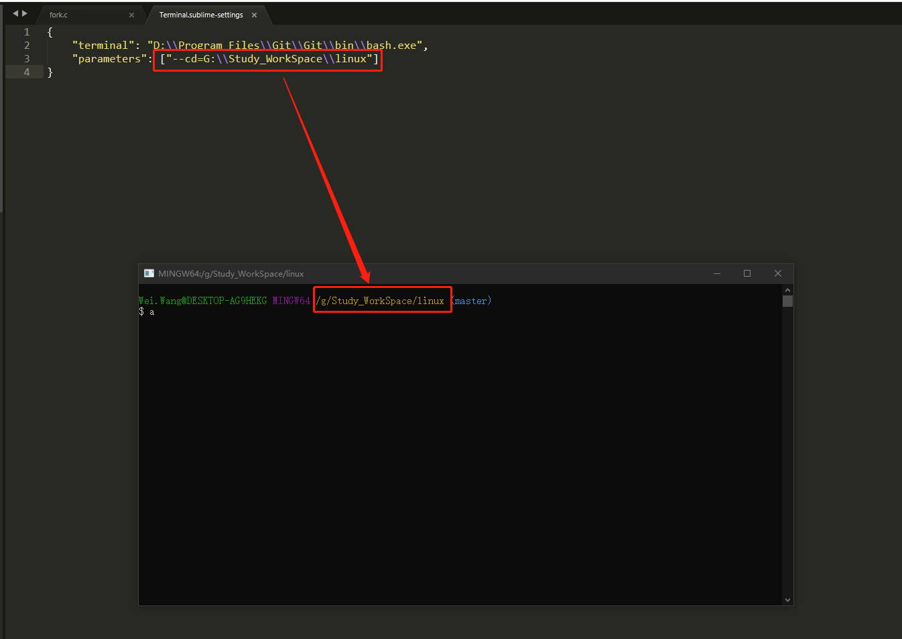

# Windows下bash的使用技巧
## 01.使用命令的方式在指定目录下启动bash.exe
+ 命令: D:\\Program Files\\Git\\Git\\bin\\bash.exe --cd=G:\\Study_WorkSpace\\linux
   - **D:\\Program Files\\Git\\Git\\bin\\bash.exe** 是 git-bash的路径，路径中的空格需要使用双引号包起来
   - **G:\\Study_WorkSpace\\linux** 指定git-bash的启动目录为G:\\Study_WorkSpace\\linux
   - 