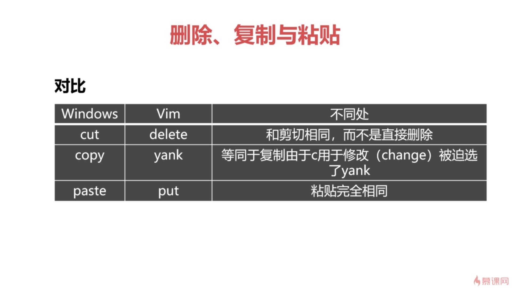
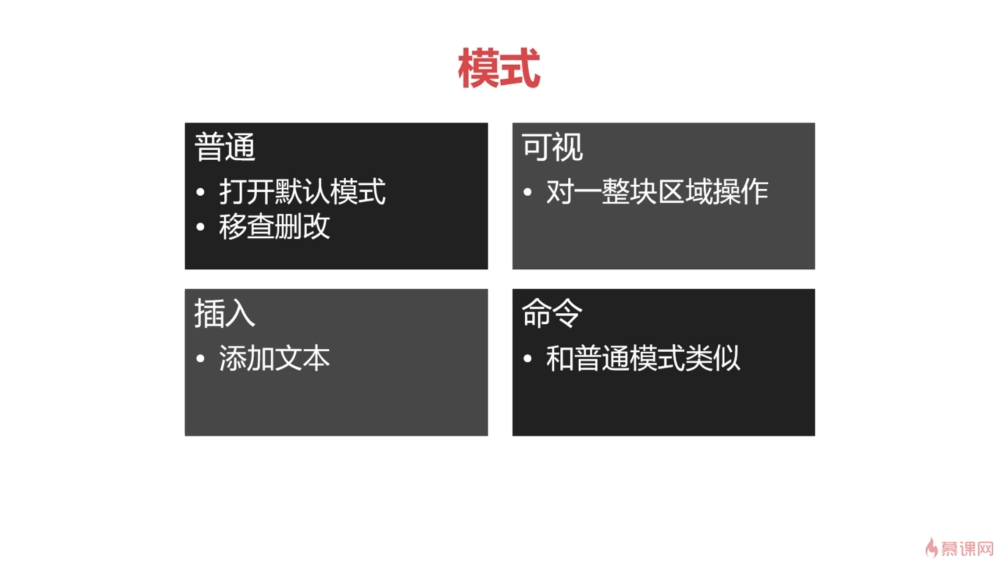
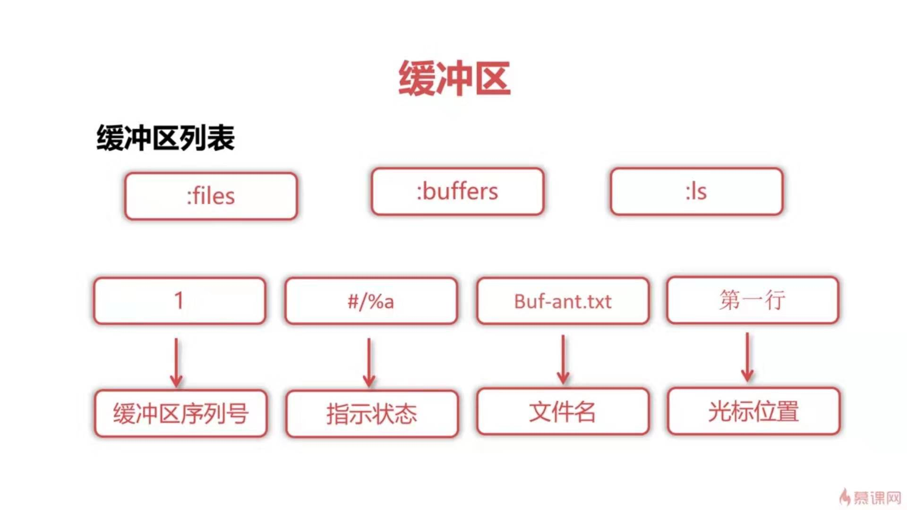
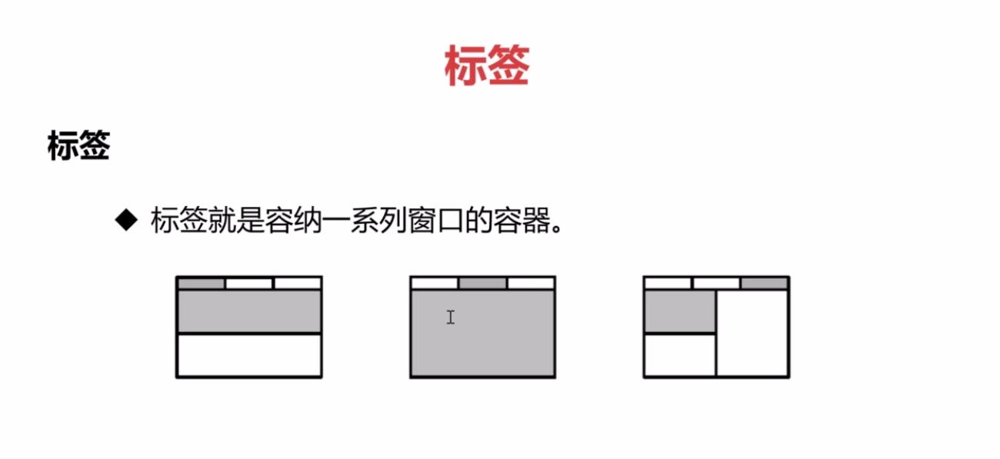

# Vim 编辑器
## Vi
+ vi 即vim前身
+ Vim = Vi + IMproved
### 相比于Vi的，更高级的功能
+ 多行撤销
+ 语法加亮和自动补全
+ 支持多种插件(通过vimrc配置)
+ 通过网络协议（HTTP/SSH）编辑文件
+ 多文件编辑
+ 编辑压缩格式文件(zip , gzip )
## vimrc
+ rc(RUN Command)
+ 系统级vimrc与用户级vimrc
+ vimrc文件每一行都代表一个命令
### vimrc的使用
+ 查看版本  ：version
+ 编辑vimrc文件  ：e  ~/.vimrc
+ 注释  双引号引号(")
### 编辑vimrc文件，定制更高级功能
除了在vimrc文件中设置，在命令行中也可以设置(例如:set number 设置行号)
+ 在命令号模式下，:set number?(注意，是这个问号) 会返回这个功能的状态是什么
+ 关闭功能  在option前面加no，例如关闭行号显示 set nonumber
+ set history  保存命令行中的历史记录，向上向下查看历史
+ set ruler 光标的位置（vim 右下显示的信息 第几列第几行）
+ set hlsearch 查找的时候，匹配的值高亮显示（敲了回车才高亮显示）
+ set incsearch  查找的时候，匹配的值高亮显示(边输入，匹配的值就高亮显示 。只有第一个才会边输入边高亮)
+ set ignorecase  查找时忽略大小写
+ set number 显示行号
+ set autoindent 复制上一行的缩进到下一行
+ set smartindent 
+ map &lt;F3> i&lt;ul>&lt;CR>&lt;Space>&lt;Space>&lt;li>&lt;/li>&lt;CR>&lt;Esc>I&lt;/ul>&lt;Esc>kcit 
  - map 即 定制快捷键。如上 定义了一个快捷键F3.**F3后面就是一系列的操作** 首先 i,进入插入模式，在输入&lt;ul&gt;在按回车(CR)........
  - 即:在默认模式下按F3就是输出：
```html
<ul>
   <li></li>
</ul>
```
+ let mapleader=","  赋值操作 
+ map &lt;leader&gt;w :w!<CR> 配合let mapleader="," 则在普通模式下，输入逗号(,)及w就可以对文档进行保存了。 &lt;leader&gt;就是一个前缀，输入命令时要加这个前缀然后是&lt;leader&gt;后面的指令（自定义的，这里定义的是w）.这个&lt;leader&gt;的是可以配置的，在脚本里面这样写，let mapleader=','，然后下次你输入,w就执行命令了(这里是w!)。
### 删除、复制、粘贴 
windows中与vim中的区别：
<div></div>
+ 在vim中，复制、粘贴、删除都是使用操作的首字母

#### Vim模式
<div></div>

##### 普通
   vim filename 打开文件后的模式
##### 可视

|进入可视模式按键|含义|
|---|---|
|v|字符选择，会将光标经过的地方反白选择|
|V|行选择，会将光标经过的行进行反白选择|
|[Ctrl] + v|块选择，可以用**长方形**的方式选择数据|
|y|将反白的地方复制|
|d|将反白的地方删除|
----------------------------------------
`对一整块区域操作，例如可以用来进行多行注释`
##### 插入
  在普通模式下按i进入的模式
##### 命令
   即 :register
#### vim特性
##### 寄存器
|类型|含义|表示方式|举例|特点|
|---|---|---|---|---|
|无名寄存器|默认寄存器|“”|“” p=p|会被最后一条覆盖|
|数字寄存器|"+{0~9}缓存最近10次操作|"0 "{1~9}|"0P "1P|0用于复制专用，1～9用于最近9次行删除或者修改|
|有名寄存器|26英文字母命名有名寄存器|”[a-z]/[A-Z]|"ayw|"A会通过^J追加到"a寄存器中|
|黑洞寄存器|有去无回|"_|"_dw|只想删除而不想覆盖无名寄存器|

+ 如 "1yy(普通模式连续输入),那么就会将内容复制到寄存器1中。再“1p(连续输入)，那么就会将寄存器1中的内容粘贴。
+ 如 "ayw(连续输入)，会将光标所在的单词复制到有名寄存器a中。"ap(连续输入)就会将有名寄存器a中的内容粘贴出来
##### 组合操作
语法:[count]operation([count]{motion})
+ `operation可以是d(删除) 、 yy(复制)`

motion---表示操作范围的指令
|按键|含义|
|---|---|
|0	|将光标定位到行首的位置|
|^	|同上|
|$	|将光标定位到行尾的位置|
|b	|将光标定位到光标所在单词的起始处|
|e	|将光标定位到光标所在单词的结尾处|
|w	|将光标定位到光标所在单词的下一个单词起始处|
|gg|	将光标定位到文件的开头|
|G|	将光标定位到文件的末尾|

+ x/X 删除光标后/前一个字符
+ dw（d=delete w=word） 删除一个单词，光标必须在词首`这里w就是一个motion了`
+ d{hjkl}  删除一个操作前的字符
+ d$=D 删除光标到行尾的字符
+ d^ 删除光标到行首的字符
##### 文本对象
+ w word
 + s sentence
 + p paragraph

|指令| 含义|
|---|---|
|viw|选中单词|
|vis|选中句子|
|vip|选中段落|
|vi(|选中括号(中的内容|
|vi{|选中括号{中的内容|
|vit|选中标签中的内容|


|指令| 含义|
|---|---|
|v2i{|选中两层大括号中的内容，2代表嵌套的层数|
|v3aw|选中三个单词，包含中间两个分隔空格|
|v3iw|选中三个单词(两个单词+间隔空格)|

`可以将v替换为c、x、d、y等操作符来操作文本对象`
##### 宏
解决重复问题
步骤
1. 规范光标位置:0
2. 执行编辑和操作
3. 移动光标到容易回放的位置:j
#### 插入
+ shift + i/A  插入模式，并移动到行首/尾
+ a/i  光标前/后插入
+ [n]O/o 行前/后插入n次
  - 先按5 -> 再按O/o ->输入要插入的内容"Hello" -> 按ESC ，一秒后，就会在行前/后插入5次Hello
+ [n]i 插入模式重试n次
  - 先按5 -> 再按i -> 输入要插入的内容”Hello“ -> 按ESC  ， 一秒后，就会在这里行产生5个Hello 
#### 替换
+ F/f{char}  反向/正向查找某个字符 
  - 只能在某一行内查找  按f -> 按需要查找的字符 -> 光标就会在目标字符上
+ t{char} 查找字符前一个字符
  - 光标会停留在目标字符前一个字符上，行内查找。（向后查找）
+ dt{char} / df{char} 删除光标到查找字符间的字符
  - 先按d再按t -> 键入要查找的字符 
+ /{char} 命令行查找(可以使用正则表达式 /print*)
#### 复制
+ yw  复制当前光标单词
+ y2w 复制正向两个单词
+ p/P = put = paste 粘贴到光标后/前
+ yy 复制当前光标所在的行
#### 转换
+ ~  单个字符大小写转换
+ g~w 单词大小写转换
+ g~$/g~~ 整行大小写转换(光标后的会转)
+ gU/uw 单词大小写转换 
#### 替换
语法：[range]s[ubstitute]/[pattern]/{string/[flags]
+ s/going/rolling/g 当前行所有going换为rolling
+ %s/going/rolling/g %匹配所有范围
#### 撤销/重做
+ u = undo 撤销
+ ctrl + r = redo 重做/恢复之前的操作
#### 缓冲区
+ buffer 是内存中的一块缓冲区域，用于临时存放Vim打开过的文件
+ 缓冲区列表
  <div></div>
##### 缓冲区列表指示状态
|标记|含义|
|---|---|
|a|激活缓冲区，该缓冲区被加载且被显示|
|h|隐藏缓冲区，被加载但没有显示|
|%|当前缓冲区|
|#|交换缓冲区|
|=|只读缓冲区|
|+|已更改缓冲区|
|-|不可改缓冲区|
##### 缓冲区列表操作
|指令|含义|
|---|---|
|:bp[revious]|上一个缓冲区|
|:bn[ext]|下一个缓冲区|
|:bf[irst]|回到第一个缓冲区|
|:bl[ast]|回到最后一个缓冲区|
|:buffer number/file_name|指定缓冲区|
|:ball|编辑所有缓冲区(`会分屏显示打开的文件`)|
|ctrl + ^/b#|回到前一个缓冲区(交换buffer)`ctrl+v是普通模式，b#为命令行模式`|
|:qall!|退出所有缓冲区|
|:wall!|写入全部缓冲区(即保存文件，且不会退出缓冲区)|
|:badd|添加一个新的缓冲区|
|:bd[elete]|删除缓冲区|
|:n,m/%bd|删除编号n,m/所有的缓冲区文件|
|:bufdo {cmd}|bufdo set number|

#### 分屏
|指令| 含义|
|---|---|
|vim -O/on| 水平/垂直分屏|
|ctrl + w  s|上下分割当前打开的文件|
|:sp filename | 上下分割，并打开一个新文件|
|ctrl + w  v|左右分割当前打开文件|
|:vsp filename| 左右分割，并打开一个新文件| 
|ctrl + w  c/q|关闭当前窗口/最后一个窗口``|
##### 移动分屏与尺寸变动
|指令| 含义|
|---|---|
|ctrl + w k| 光标移动到上一个分屏|
|ctrl + w h| 光标移动到左一个分屏|
|ctrl + w j| 光标移动到下一个分屏|
|ctrl + w l| 光标移动到右一个分屏|
|ctrl + w +| 增加高度|
|ctrl + w -| 降低高度|
|ctrl + w =| 所有屏高度一致|
|ctrl + w n <|减少n个字符的宽度|
|ctrl + w n >|增加n个字符的宽度|
##### 标签
标签就是容纳一系列窗口的容器  <div></div>

|指令| 含义|
|---|---|
|:tabnew|创建新标签页|
|:tabfind|查找并在新标签页打开文件|
|:tabs|显示已打开的标签页的列表|
|:tabclose|关闭当前标签页|
|:tabonly|仅保留当前标签页打开|
|:tabn/p/first/last|跳转到下/上/第一个/最后一个标签页|
|:tabm|将当前标签页放在指定位置|
|gt/T|移动到下/上个标签页|
|{i}gt|移动到i位置的标签页|
|:tabe|编辑标签页中的某个文件|
|tabm 0/tabm|移动当前tab页到第一个/最后一个位置|
|tabm{i}|移动当前tab到i+1的位置|

## 快捷键
+ shift + i 插入模式，且回到行首
+ A  回到行尾
+ 0（数字） 光标回到行首 
+ ngg/nG  快速到某一行 。 n为指定行数
+ gv 重选上次高亮选区

## vimrc文件设置
+ set showcmd
  - 命令模式下，在底部显示当前键入的指令。比如，键入的指令是2y3d，那么底部就会显示2y3，当键入d的时候，操作完成，显示消失。