# 锁
读完这一章，会学到什么？
+ 锁与事务
+ InnoDB存储引擎中锁的类型与算法
+ 锁的内部实现
+ 显式锁与隐式锁
+ 加锁操作
## 锁与事务
+ 什么是事务的隔离性
   - 每个读/写的事务对象对其他的操作对象能相互分离，即该事务提交前对其他事务是不可见的。
+ 事务隔离性的要求
   - 当数据库中的并发事务各自执行的时候，每个事务的运行不受其他事务的影响。在事务提交之前也看不到其他事务的执行结果
   - 若采用加锁技术实现的数据库并发系统的影响时间大于串行运行的时间，那么这就不是一个可以被接受的加锁方式。即要求一种简单或者开销比较小的方式来实现加锁的技术。
+ 事务的隔离级别(《Transaction Processing》P401)
   - READ UNCOMMITED(浏览:一级)
   - READ COMMITED(游标稳定性：二级)
   - REPEATABLE READ(没有幻像保护的三级:2.999级)
   - SERIALIZABLEA(三级)
+ 隔离级别PS
   - REPEATABLE READ mysql默认的隔离级别。InnoDB在可重复读事务隔离级别下，使用了**Next-Key Lock**的算法(在其之上的隔离级别是没有使用这种算法)，因此避免了幻读的产生。所以InnoDB在默认的REPEATABLE READ的事务隔离级别下已经能完全保证事务的隔离性要求，即达到了SQL标准SEARIALIZABLE隔离级别
   - “此外，我知道大部分的用户质疑SEARIALIZABLE隔离界别带来的性能问题，但是根据Jim Gray在Transaction Processing:Concepts and Techniques 一书中指出，两者(2级和3级隔离级别)的开销几乎是一样的，甚至SEARIALIZABLE 可能更优！！！因此在InnoDB存储引擎中选择REPEATABLE READ 的事务隔离级别并不会有任何的性能损失，同样，选择READ COMMITED的隔离级别，用户也不会得到性能大幅度的提升”。那，干嘛不用2.999级的呢。
+ 幻读
  - 什么是幻读？
    + 指在同一事务下，连续执行两次同样的SQL语句可能导致不同的结果。第二次的SQL语句可能返回之前不存在的行。
    ```sql
       SELECT * FROM T WHERE a > 2 FOR UPDATE;
    ```
    + 假如在第二次运行上面的sql之前，有其他的事务插入了a大于2的记录，则第二次返回的结果与第一次不同。这就是幻读。**违反了事务隔离性要求的第一点：当前事务不能读取其他事务所做的修改**
## 锁的类型与算法
### 锁的类型
+ InnoDB存储引擎实现了两种标准的行级锁
  - 共享锁(S Lock)：允许事务读取一行数据
  - 排他锁(X Lock): 允许事务删除或者更新一行数据
+ 兼容性
  Type | X | S
  -|-|-|
  X | 不兼容 | 不兼容
  S | 不兼容 | 兼容
  - 兼容性：指事务A获得一个某行某种锁之后，事务B同样的在这个行上尝试获取某种锁，如果能立即获取，则称锁兼容，反之叫冲突。
+ MySQL意向锁
  - InnoDB为了支持多粒度锁定，这种锁允许事务在行记录级上和表级上的锁同时存在。为了支持在不同粒度上进行加锁操作，InnoDB存储引擎支持一种额外的锁方式——意向锁。意向锁是将对象分为多个层次，意向锁意味着事务希望在更细的粒上进行加锁。
  - <div align=center>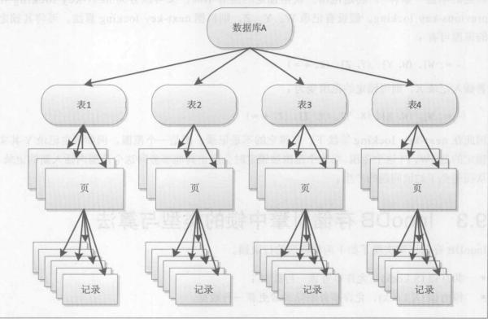</div>
  - 先到对粗粒度的对象上锁，才能对细粒度的对象上锁。例如：需要对页上的记录r上x-lock锁，那么分别需要对数据库A，表，页上意向锁IX，最后对记录r上x-lock。
  - **意向锁类型**
    + 意向共享锁(IS Lock):一个事务想获得一张表下的某几行的共享锁
    + 意向排他锁(IX Lock):事务想获得一张表中某几行的排他锁。
    + 兼容性
        Type | IS | IX | S | X
         -|-|-|-|-|
         IS| 兼容 | 兼容 | 兼容 | 不兼容
         IX| 兼容 | 兼容 | 不兼容 | 不兼容
         S | 兼容 | 不兼容 | 兼容 | 不兼容
         X | 不兼容 | 不兼容 | 不兼容 | 不兼容
    + InnoDB支持的是行级别的锁
### 锁算法
#### record lock
+ 单个索引记录上的锁
#### gap lock
+ 间隙锁，锁定一个范围，但是不包含记录本身
#### next-key lock
+ gap lock + record lock。锁定一个范围，并且包含范围本身
#### 行锁就是索引记录锁
  行锁就是一个索引记录锁，锁住的是索引上的记录
##### 示例
    假设有记录W,Y,Z,则根据next-key locking算法，可将其锁定的范围有：(infimum，W] , (W,Y] , (Y,Z] , (Z,supermum) , 若插入记录X，则可以锁定的范围有：(infimum，W] , (W,X] ,(X,Y] , (Y,Z] , (Z,supermum) 。因此在next-key locking算法下，器锁定的不是记录，而是一个范围。例如锁定记录Y其实锁定的是(W,Y]这个范围，当这个范围被锁定时会阻止其他事务向这个范围内插入新的记录，从而避免了幻读问题的产生。
### 锁的内部实现
##### 数据结构
###### 行锁在InnoDB存储引擎中的定义
```C
     struct lock_rec_struct{
        ulint  space; /*space id*/
        ulint  page_no; /*page number*/
        ulint  n_bits; /*number of bits int the bitmap (位图，记录行是否锁住)*/
     };
```
+ 锁是根据页的组织形式来进行管理的。若要知道页中某一条记录是否已经上锁，则通过位图的方式来判断该记录是否已经持有锁，位图中的索引与记录的heap_no一一对应，因此上述数据结构还隐含lock bitmap的信息。但由于lock bitmap 是根据页中的记录数量来进行分配内存空间的，索引不显式地对其进行定义。变量n_bits表示需要占用多少位用于位图的管理。由于页中的记录可能在之后还会继续增加，因此这里额外预留LOCK_PAGE_BITMAP_MARGIN（64）个记录的位图信息。
+ 假如页(20,100)中有250条记录，变量n_bits=250+64=314,那么实际需要n_bytes = 314/8 + 1 = 40个字节用于位图的管理。
+ 页中heap_no 为2 3 4 的记录全部上锁了。<div align=center>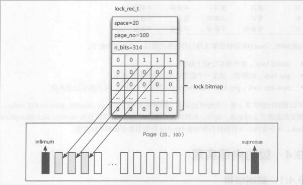</div> 上锁了的记录的heap_no位图值都为1
###### InnoDB还支持表锁。表锁分为两大类，意向锁和自增锁。数据结构定义如下
```C
   /*A table lock*/
    typedef struct lock_table_struct  lock_table_t;
    struct lock_table_struct{
       dict_table_t* table;/*database table in dictionary cache*/
       UT_LIST_NODE_T(lock_t) locks;/*list of locks on the same table*/
    };
```
+ 上述的数据结构lock_rec_t ,lock_table_t 只是单独的定义，而实际产生的锁实在事务中。**因此每一个事务，对应每一个行锁或者表锁，会有一个锁的结构**如下：
  + ```C
        /*Lock struct*/
        struct lock_struct{
           trx_t* trx;/*transaction owning the lock*/
           UT_LIST_NODE_T(lock_t) trx_locks; /*list of the lock or the transaction*/
           ulint type_mode;/*lock tyle , mode , gap flag,and wait*/
           hash_node_t hash;/*hash chain node for a record lock*/
           dict_index_t* index; /*index for record lock*/
           union{
              lock_table_t tab_lock;/*table lock*/
              lock_rec_t rec_lock;/*record lock*/
           } un_member;
        };

    ```
+ 数据结构lock_struct 是根据每个事务的每个页(或每个表)进行定义的。然而一个事务可能在不同的页上有多个行锁，以此在这里需要变量try_locks将一个事务的所有锁信息进行链接。这样还可以快速查询一个事务中所有的锁信息。
+ 除了查询某一个事务的所有信息，系统还需要根据某个具体的行记录来查询对应的锁信息。因此还需要一个全局变量来对事务中的行进行对应锁信息的查询。定义如下:
+ ```C
   /*the lock system struct*/
   struct lock_sys_struct{
        hash_table_t* rec_hash;/*hash table of the record locks*/
   };
  ```
  函数lock_sys_struct用于初始化lock_sys_struct对象，也就是初始化对应锁信息的哈希表。哈希表中槽的数量右变量srv_lock_table_size决定。
+ lock_sys_struct 对象中哈希表的键值通过页的page和page_no计算而得(函数 lock_rec_fold(space , pageno)).<strong>因此：  </strong>**查询某一行是否有锁，首先根据行所在的页进行哈希查询，然后根据查询得到的lock_rec_t,扫描lock bitmap,才能最终得到该行记录是否有锁。**
+ MySQL并不是对每一行记录进行锁信息的管理,因此**MySQL不支持也不需要锁升级的功能**
###### MySQL InnoDB锁管理的好处
+ 假如一张表有3000000个数据页，每个页大约100条记录。那么总共右30000000个记录。若有一个事务执行全表更新的sql语句，则需要对所有的记录加上x-lock.若根据每行记录产生锁对象进行加索，并且每个锁占用10字节。则仅对锁管理就需要差不多3GB的内存。而InnoDB根据页进行加锁，并采用位图的方式，假设每个页存储的锁信息占用100字节，则锁对象仅需要300MB。
+ InnoDB数据结构关系图<div align=center>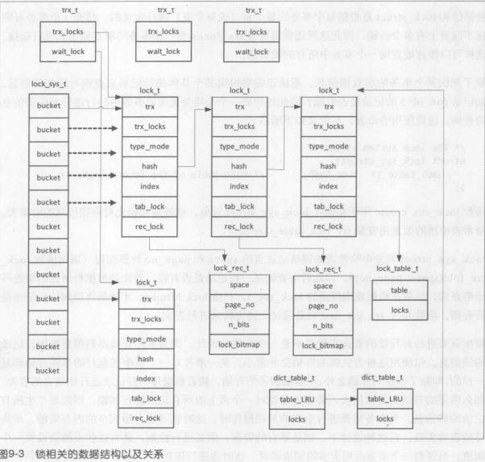</div> 
  - 可以看出，每一个事务都有一个类型为trx_t的内存对象，其中保存这这个事务的锁信息链表以及指向正在等待的锁信息。可以根据以下两种方式对锁进行查询
      + 根据事务
      + 根据记录
  - 第一种方式通过trx_t对象的trx_locks链表，再通过lock_t对象中的trx_locks进行遍历可得到某个事务所持有或者正在等待的锁信息。第二种根据记录所在的页进行哈希查询，再通过lock bitmap进行判断。
#### 锁的类型与模式
- InnoDB支持行锁和表锁，因此锁的类型有
  + #define LOCK_TABLE 16 /*these type value shoulds be so high that*/
  + #define LOCK_REC 32 /*they can be oRed to the lock mode */
- 锁的模式
  + S #defind LOCK_S 4
  + X #defind LOCK_X 5
  + IS #defind LOCK_IS 2
  + IX #define LOCK_IX 3
  + AI #defind LOCK_AUTO_INC 6
  +    #defind LOCK_NONE 1 
- 在InnoDB存储引擎中，锁的类型和模式都保存在一个字段中，即数据结构lock_t的变量type_mode中。宏LOCK_MODE_MASK , LOCK_TYPE_MASK可分别用来提取对应锁的模式和类型信息。另外，type_mode还保存了另外两个标识位：LOCK_WAIT和LOCK_GAP。LOCK_WAIT表示当前的请求的锁并没有被授权，处于等待状态。LOCK_GAP表示该锁是一个gap锁。不需要锁住自身。例如如下记录
  + 2,4,6,8,10
  + **在next-key locking 算法下，该用户锁住8这条记录，那么其实锁住的是一个范围，即(6,8].如果在锁住8的时候，将type_mode设置为LOCK_GAP，则这时候表示锁住的范围是(6,8).8这条记录不锁住**
  + **对于插入操作，需要判断下一条记录是否有加锁，但是锁的类型为LOCK_GAP即可，因为不需要对插入记录的下一条记录进行加锁，这样提高了数据库的并发性。因此，对于supermum记录，其总是LOCK_GAP,因为其为伪记录，表示一页中最大的记录。也可以理解为正无穷。**
+ 锁的类型与兼容性
   Type|AI | IS | IX | S | X
   -|-|-|-|-|-|
   AI| 不兼容 | 兼容|兼容|不兼容|不兼容
   IS| 兼容|兼容 | 兼容 | 兼容 | 不兼容
   IX| 兼容|兼容 | 兼容 | 不兼容 | 不兼容
   S | 不兼容|兼容 | 不兼容 | 兼容 | 不兼容
   X | 不兼容|不兼容 | 不兼容 | 不兼容 | 不兼容
### 显式锁与隐式锁(属性)
#### 显式锁与隐式锁的区别
+ explicit lock（显式锁）,分为gap explicit（仅锁住范围）与no gap explicit(锁住的是记录以及记录之前的范围)。可以是s-lock也可以是x-lock。显式锁是直接的，例如select * from t where rowed = xxx for update;那么就需要对这个记录进行加锁。锁的类型为x-lock。
+ implicit lock（隐式锁）.指索引记录**逻辑上**有x-lock，但在实际内存上并不含有这个锁信息。这意味着隐式锁没有任何内存开销，从而进一步减少InnoDB的内存开销。
##### 隐式锁
+ 行锁本质上就是索引记录锁。当锁定一行聚集索引记录时，若该记录上还有辅助索引，根据谓词锁的要求还应该对相应辅助索引上的记录进行加锁。**在InnoDB中，implicit lock既可以存在于聚集索引记录中，还可以存在于辅助索引记录中**。故，我们可以通过索引查询来降低锁的范围，来避免锁，从而提高并发。
+ 对于聚集索引记录，例如用户插入了一个人row id为4的新纪录，但事务还没有提交。这时row id 为4的记录就包含一个implicit lock。然而在全局的lock_sys变量中查询不到这个新纪录的锁，因此这个锁是隐式的。
+ 对于辅助索引记录，例如对row id为4的聚集索引记录进行了更改，并且更改的列是辅助索引的列，那么在该辅助索引上同样存在一个隐式锁。
+ 但是，并不是每次上述的的update操作都会产生implicit lock,这取决于加锁是否需要等待。若需要等待则产生ecplicit lock。因为，只有创建了需要等待的explicit lock对象，那么释放后才能进行唤醒操作。**隐式锁会在特定的时候升级为显式锁，因为显式锁是真正的锁**。**由于implicit lock的存在，在对某记录进行加锁前，可能需要将implicit lock转化为explicit lock（通过lock_rec_convert_impl_to_expl函数）,并将锁信息插入到全局变量lock_sys的哈希表中**
###### 聚集索引记录的隐式锁
+ 每一个聚集索引记录都有一个事务id的隐藏列。只需要通过该事务id就能够判断当前是否为活跃事务就能知晓是否右implicit lock。若通过该事务id查询这个事务是活跃事务，则此聚集索引记录上右implicit lock.反之，则不含有implicit lock.
###### 辅助索引记录的隐式锁
+ 辅助索引记录是不含有隐藏的事务id的，因此判断辅助索引记录上是否有implicit lock则需要通过PAGE_MAX_TRX_ID(每个辅助索引页通过page_header的PAGE_MAX_TRX_ID来保存一个最大的事务ID，当辅助索引中的任何记录被更新后，都需要去更新这个最大的事务ID)和 聚集索引记录。
+ 判断辅助索引记录上是否有implicit lock,有以下两步
  - 根据辅助索引页的PAGE_MAX_TRX_ID值进行判断
  - 通过聚集索引记录进行判断
+ 由于每次辅助索引记录的修改都需要更新页的PAGE_MAX_TRX_ID值，因此**若当前PAGE_MAX_TRX_ID的值小于当前活跃事务的最小id时，则此辅助索引记录不含有implicit lock**。若PAGE_MAX_TRX_ID大于等于当前活跃事务的最小id时，存在以下可能性
   - 1.存在某活跃事务，修改了辅助索引记录。从而导致了PAGE_MAX_TRX_ID的更新
   - 2.存在事务(可能是活跃事务，也可能是已完成提交操作的)，修改了页中其他的辅助索引记录而导致了PAGE_MAX_TRX_ID的更新。
   - 此时，则需要通过辅助索引记录对应的聚集索引来判断是否含有implicit lock（由函数row_vers_impl_x_locked_off_kernel实现）。
+ 函数row_vers_impl_x_locked_off_kernel不仅要判断辅助索引记录是否含有锁，如果有锁，还要返回当前持有的锁的事务对象。由于辅助索引记录不包含隐藏的事务id列，因此该信息必然需要通过对应的聚集索引记录来获得。**由前面的数据结构（lock_struct）可得，事务对象我们可以通过事务id去获取**
###### 如何判断implicit lock
+ 函数row_vers_impl_x_locked_off_kernel流程图<div align=center>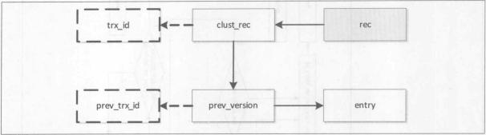</div>途中灰色阴影的记录rec就是辅助索引记录，通过该辅助索引记录可以得到聚集索引记录clust_rec,由于聚集索引记录上右隐藏的事务id，因此还可以得到对应的trx_id.此外，通过undo log来构造聚集索引记录之前版本的聚集索引记录prev_version以及对应的辅助索引记录entry。之后，就可以进行如下的判断了
   - 若trx_id对应的事务为不活跃的事务，则辅助索引记录rec不含有implicit lock
   - 若prev_version为null，则表示没有之前版本的记录，即是当前事务插入的记录，则辅助索引记录含有implicit lock
   - 若rec==entry,两个版本的辅助索引记录相等，但是两个记录的delete flag(为1表示删除了)位不同。则表示某活跃事务删除了记录，因此辅助索引有implicit lock
   - 若rec!=entry ,两个版本的辅助索引记录相等，且rec的delete falag为0，表示某活跃事务更新了辅助索引记录，因此辅助索引记录rec含有implicit lock
   - 若rec==entry，且两个记录的delete flag位相同。则既可能是当前某活跃事务修改了rec，也可能是之前已提交的事务修改了rec。若trx_id != prev_id,则表示之前的事务已经修改了记录，因此rec上不含有implicit lock，否则，需要通过再之前的记录版本进行判断
   - 若rec!=entry且rec的delete flag 为1,则既可能是当前某活跃事务修改了记录rec，也可能是之前已提交的事务修改了记录rec。若trx_id != prev_id，则表示之前的事务已经修改了记录，因此记录上不含有implicit lock。否则，需要通过再之前的记录版本进行判断。
+ 示例
```sql
      CREATE TABLE `t` (
      `a` int(11) NOT NULL,
      `b` int(11) NOT NULL,
      `c` int(11) NOT NULL,
      PRIMARY KEY (`a`),
      KEY `b` (`b`)
      ) ENGINE=InnoDB DEFAULT CHARSET=utf8mb4 
```
insert into t values(1,2,3);
  - 示例一：进行查询 select b from t where b = 2 for update;则索引记录的状态如下图<div align=center>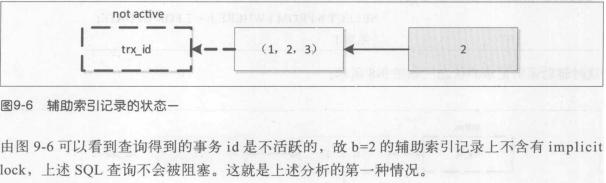
  - 示例二，按如下情况进行查询<div align=center> 此时辅助索引状态如图<div align=center>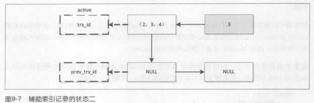.可以看到记录b对应的聚集索引记录为(2,3,4),而这个聚集索引的事务id表示其是活跃的（事务A尚未提交）。通过聚集索引记录构造之前版本的记录为null，因此b=3的辅助索引记录上是由implicit lock的，事务B阻塞。
  - 示例三：按如下情况进行查询<div align=center>此时辅助索引状态如图<div align=center>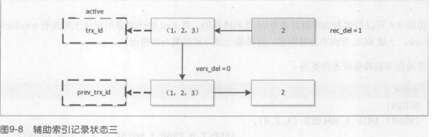.当前辅助索引记录的值是相等的。即b的值都为2,不同的是两者的delete flag不同。因此b=2的辅助索引上有implicit lock。事务B阻塞
  - 示例四：按如下情况查询<div align=center>此时辅助索引状态如图<div align=center>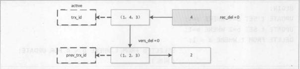当前记录与之前版本辅助索引记录的值是不相等的，并且当前记录的delete flag为0.故b=4的辅助索引上含有implicit lock
  - 示例五 <div align=center>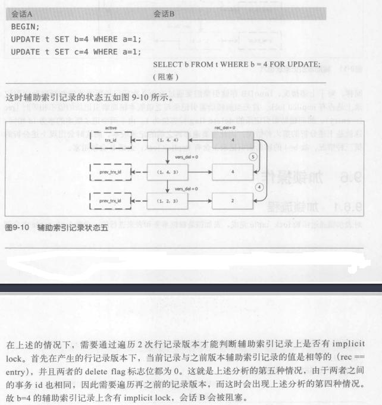
  - 示例六 <div align=center>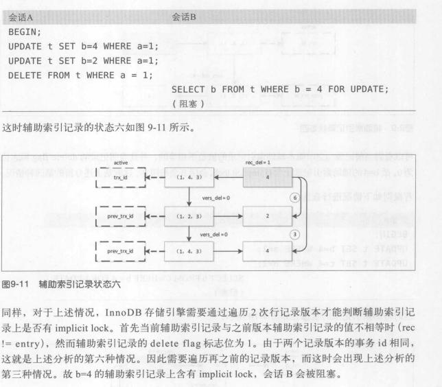
## 加锁操作
### 加锁流程
+ 对表加锁通过lock_table 函数完成，表加锁是根据事务和表来进行的。函数lock_table中会调用函数lock_table_create来完成对与表锁对象lock_t的初始化。产生表锁对象lock_t加入到表对象dict_table_t的locks链表中。通过此链表可以遍历出表上所有的锁信息。可对表加任何类型的锁。**S、X表示需要锁住表，即当前层。对表加IS、IX意向锁表示需要对下层进行加锁**
+ 对行记录加锁通过函数lock_rec_lock完成，行记录加锁根据事务和页来进行。需要注意的是：
   - 对记录进行加锁，这是否为implicit lock
   - 锁对象lock_t是否可以重用
+ 是否为implicit lock，这通过函数lock_rec_lock中的参数impl来决定。若是implicit lock，并且当前没有该锁的冲突模式存在，则不需要产生一个lock_t的对象。否则，通过函数lock_rec_create创建一个lock_t对象，并加入等待队列。这样是为了不存在冲突模式时，可以减少锁的创建。例如：当前仅有一个线程在执行update t set key_colomn = xxx where row_id=1,**若操作不需要发生等待则不需要对辅助索引记录xxx进行加锁** ----》**需要的时候才会去真正创建锁**
+ 锁重用： 为了减少锁的开销，InnoDB可以重用已经创建的lock_t对象。**锁重用的前提**是同一事务的同一页面中的记录,并且锁的模式相同。
   ```sql
      begin;
      select * from t where rowid = xxx for update;
      select * from t where rowid = yyy for update;
   ```  
  上述事务中，当执行第一个sql语句，InnoDB会创建一个锁对象lock_t,并将对应heap_no位图中的值设置为1，。若第二条sql查询rowid为yyy的记录与rowid为xxx的记录在同一页，那么这时事务可以重用锁对象lock_t,只需要将对应heap_no位图中的值设置为1即可。
   - 且，若事务锁住同一行记录，并且第二次加锁的强度弱于之前锁的模式，则同样不需要再次创建锁对象。
     ```sql
         begin;
         select * from t  where rowid = xxx for update;
         select * from t  where row id = yyy lock in share mode;
     ```
     事务首先会创建一个x lock模式的锁对象，第二次再次请求s lock时，由于事务已经创建了一个强于其请求锁的模式，因此不需要再次创建锁对象。
### 加锁过程
+ InnoDB的行锁就是索引记录锁，也就是**根据索引中访问得到的记录进行加锁**.InnoDB是索引组织表，每张表都有一个主键值。辅助索引中包含主键，通过辅助索引访问聚集索引中的列，需要通过书签查找，即通过辅助索引中的主键值查询聚集索引。例如**select * from table where key_column = xxx**就需要通过书签查找。另外，InnoDB还存在implicit lock，并不是每次都需要进行加锁。总的来说，加锁的过程如下：
   - 通过主键进行加锁的语句，仅对聚集索引记录进行加锁
   - 通过辅助索引记录进行加锁的语句，首先对辅助索引记录加锁，再对聚集索引记录进行加锁。
   - 通过辅助索引记录进行加锁的语句，可能还需要对下一个记录进行加锁。
+ 对辅助索引记录的下一条记录加锁是为了避免幻读的问题。如下：
   ```sql
       select * from table where key_column = xxx for update;
   ```
   这条sql不仅要锁住辅助索引记录xxx，还需要锁住xxx的下一条记录。这样就可以避免幻读。
+ 若key_column包含唯一约束，那么就不需要锁定下一个辅助索引记录。**但是**这仅对等值查询有效，对于非等值查询，不管辅助索引是否包含唯一约束，都需要锁定下一个索引记录，从而避免幻读。如：
   ```sql
      select * from table where key_cloumn <= xxx for update;
   ```
#### 示例
+ 对聚集索引记录加锁如何
  -  等值匹配：<div align=center>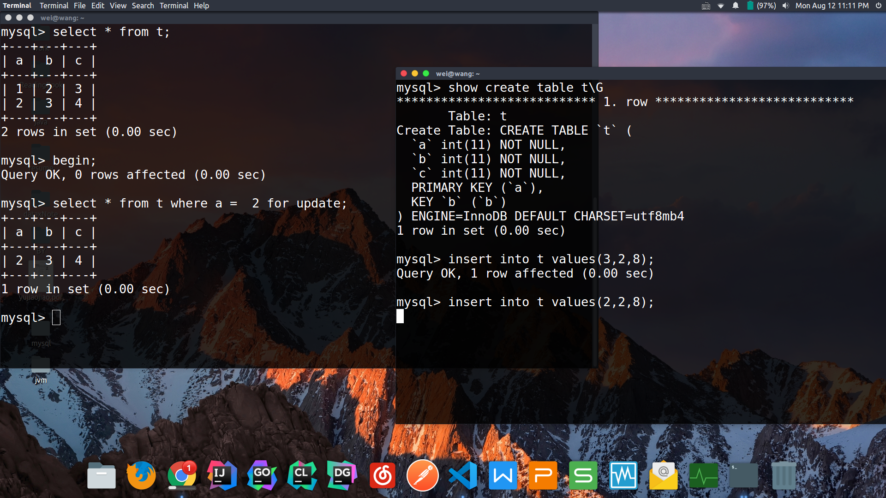可以看到，锁住的是a=2的这一条记录。
  - 非等值匹配： <div align=center>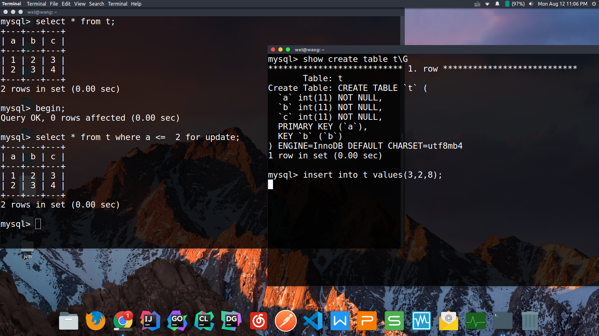 可以看到，它锁住的是一个范围。
+ 对辅助索引加锁如何
  - <div align=center>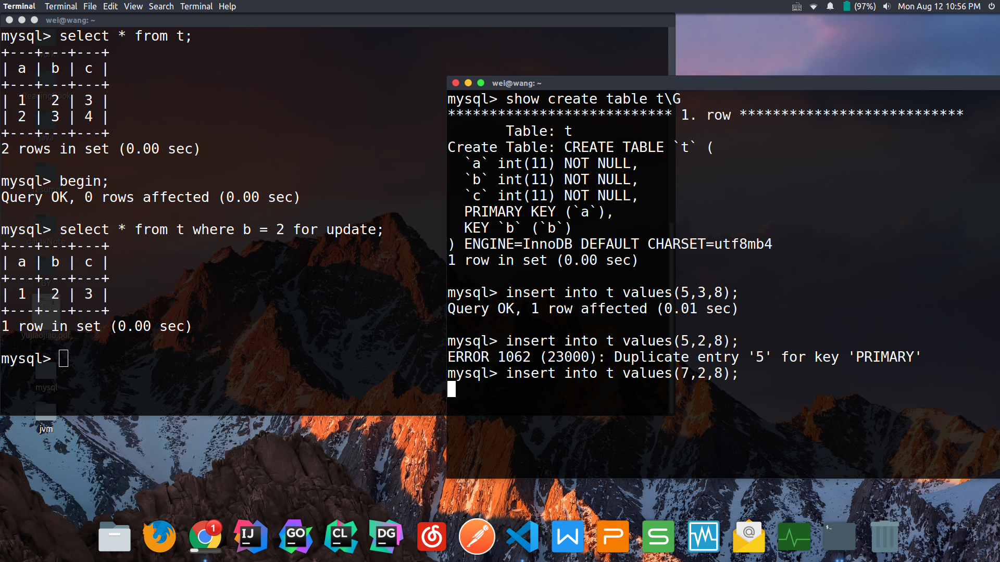
    - 如图：b字段为辅助索引字段。锁住的范围是(2,3)(gap lock),锁住的是一个范围。
+ 对普通字段加锁如何
  - <div align=center>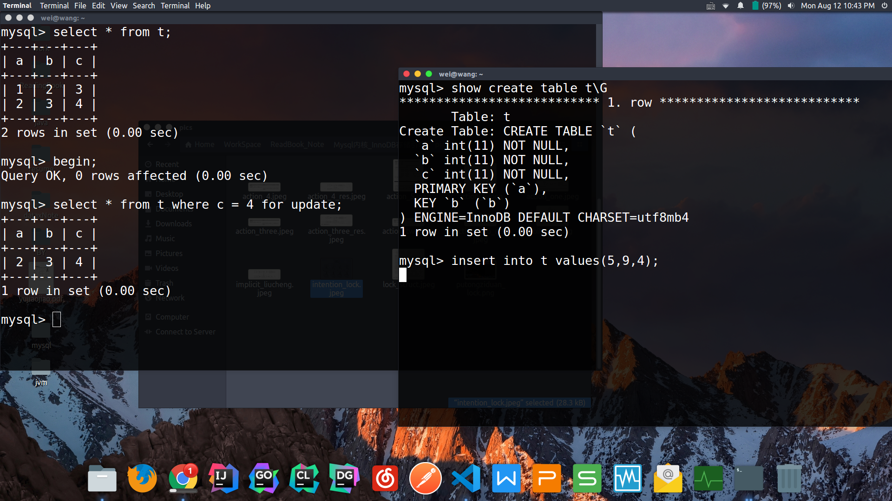 
   - 如图，字段c为普通字段，由图可得: **当对普通字段加锁时，会锁住全表** (对表加X lock)
+ 若字段是唯一索引，那么就不需要对下一条辅助索引记录加锁(**仅仅是对于等值有效**)，如主键。对于非等值，不管辅助索引有没有唯一约束，都需要锁住下一跳辅助索引来避免幻读问题。
## 行锁的维护
### 插入
+ 对InnoDB进行插入的步骤
  - 首先，对表加上IX锁
  - 根据查询模式PAGE_CUR_LE定位next_rec
  - 判断记录next_rec是否有锁，有的话就阻塞，等待锁的释放。没有的话就立即插入
+ 例如：有如下记录，1,2,3,4,5,7 ，现在要插入6这条记录。首先根据查询模式PAGE_CUR_LE定位到记录5,接着判断5这条记录的下一条记录是否有锁。如果有，则根据next-key locking算法，其表示的是:(5,7)(gap标识位为1)或(5,7]。因此，若记录7上有锁，则不允许在这个范围内进行插入操作。所以插入6这个操作被阻塞。如图：<div align=center>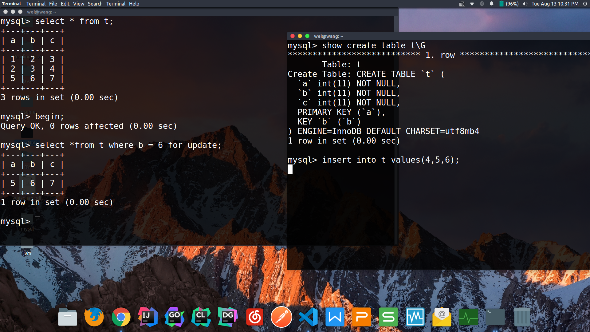 见b(辅助索引)。对于InnoDB来说，若记录next_rec上没有锁，则会直接插入，不产生任何的锁对象。否则将会调用函数lock_rec_enqueue_waiting,等待记录next_rec被释放，这时候会创建锁对象，锁定的记录为next_rec,锁的类型为LOCK_X|LOCK_GAP
+ **更新锁的范围**且，若下一条记录上有锁，在插入操作完成之后(无需事务提交)，需要调用函数lock_update_insert来更新锁的范围。例如，插入了6这条记录之后，则锁的范围由原来的(5,7]更新为了(5,6),(6,7].这样就阻止了其他事务在(5,6)的范围内进行插入操作
+ **对辅助索引记录进行锁的判断** 若插入的表上有辅助索引，那么还需要对辅助索引进行锁的判断，方法与步骤2,3相同。只是在插入完了之后，需要更新辅助索引页page header中的PAGE_MAX_TRX_ID(这个页的事务ID)
+ 函数lock_rec_insert_check_and_lock用来判断next_rec上的锁，参数inherit用来判断是否在插入完成之后掉用函数lock_update_insert来对已锁定的范围进行更新。
#### 注意
+ 等值比较下，对与主键(聚集索引)、唯一索引来说，它锁定的是这一行记录，故即使7这条记录被锁住了，6这条记录还是能够插入的进去的。这里猜想依旧是防止幻读！！！！<div align=center>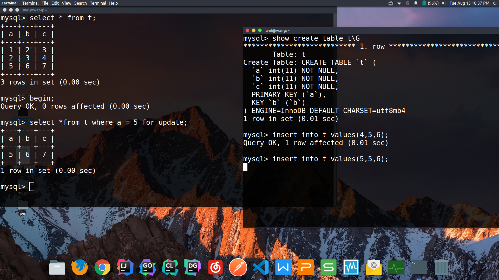
+ 只有在辅助索引的情况下,才能锁住的是范围，否则是锁住一行，**详见上述加锁过程**
### 更新
+ 当事务需要对记录进行更新(删除)前，先尝试对更新的记录加上X(implicit lock).若待更新的记录存在其他锁的时候，则事务被阻塞，需要等待记录上的锁被释放。
+ 函数lock_**clust**_rec_modify_check_and_lock和ock_**rec**_rec_modify_check_and_lock分别对聚集索引和辅助索引进行加锁。两者的过程基本相同。都是调用函数lock_rec_lock对更新的记录进行加锁操作。不同的是:
   - 聚集索引记录加锁前首先需要将记录上的implicit lock转化为explicit lock
   - 辅助索引记录加锁成功后，还需要更新辅助索引页page header中的PAGE_MAX_TRX_ID的值
+ 在事务对记录进行更新的过程中，若记录不能进行原地更新，则需要对锁进行维护，步骤如下：
   - 将更新记录的锁信息移动到页的infimum记录上
   - 删除原记录
   - 插入更新完成后的记录
   - 将页的infimum记录上的锁重新移动到新插入的记录上
### PURGE
+ InnoDB引擎对于记录的删除操作，是采用标记删除的方式。首先将需要删除记录的record header的delete flag标识位设置为1,然后通过后台的PURGE线程将记录真正的删除。
+ 在purge线程真正删除该记录之后，删除的记录的下一条记录需继承删除的记录的锁定范围。并且模式为GAP，同时释放并且重置删除记录上等待的锁
+ 对于标记为delete flag的记录，需要在定位记录后需要进一步扫描记录才能确定查询是否结束(**操作是否结束**)。例如:
```sql
    create table a(
       a int primary key,
       b varchar(30)
    ) type=innodb;

    insert into a values(1,'a');
```
  + 执行如下任务
    ```sql
       begin;
       update a set b = repeat('a',30) where a = 1;
       select * from a where a <= 1 for update;
    ```
    - 由于更新记录的大小发生改变，这时不能进行原地更新。这意味着在当purge操作发生之前(之所以为什么，全文搜索"原地更新")。一个页中包含了2个主键为1的记录。这也符合InnoDB的多版本并发控制的要求。在未执行purge操作之前主键值为1的记录，执行了事务的第二条select语句，则innodb会对两个主键值为1的记录都加上一个X lock。因为第一次加锁的记录，其record header 的delete flag被标记为一了。因此还需要访问record header中的next record来判断是否已经结束的扫描。 即:delete flag 为1的记录，在innodb中不可见了相应的操作会跳过这个记录）
## 自增锁
+ InnoDB自增锁是在插入sql语句执行完成之后**立即**释放，以这样的方式提高并发插入下的性能。
+ 每张表只能有一个自增锁
+ 自增长值,自增ID(并不会在磁盘上持久化)，而是**在每次InnoDB启动时**执行如下操作
  - select max（auto_inc_col） from t for update;
  - 将获取到的值放到内存表对象dict_table_struct的变量autoinc
  - **故，InnoDB表的自增ID(主键)是取决于当前表中最大的ID(主键)值**


## MySQL相关命令
+ 查看当前mysql的引擎信息
  - show engines \G
  - ```json
     Engine(引擎名): InnoDB
     Support(是否安装和默认): DEFAULT
     Comment(解释): Supports transactions, row-level locking, and foreign keys
     Transactions(是否支持事务): YES
     XA(分布式事务): YES
     Savepoints(暂存点,可用于回滚): YES
    ```
+ 查看当前数据库的默认引擎
  - show variables like '%storage_engine%';
  - ```json
        +----------------------------------+--------+
        | Variable_name                    | Value  |
        +----------------------------------+--------+
        | default_storage_engine           | InnoDB |
        | default_tmp_storage_engine       | InnoDB |
        | disabled_storage_engines         |        |
        | internal_tmp_disk_storage_engine | InnoDB |
        +----------------------------------+--------+
    ```
## 名词解释
+ **活跃事务**： 即当前系统中正在运行着的事务。例如：多个客户端同时执行insert ， update，delete，select这些操作，那么每一个操作所在的事务均为活跃事务。