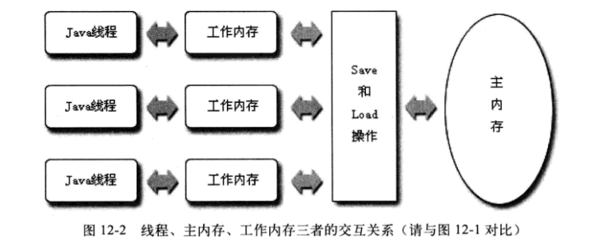

# java内存模型与线程
## 背景
  + 让计算机同时去做几件使用，不仅是计算机的算力提升了，还有一个原因:计算机的运算速度与它的存储和通信子系统的速度的差距太大。大量的时间都花费在磁盘I/O、网络通信或者数据库访问之上。如果不想处理器在大部分的时间里都处于等待其他资源的状态，就必须使用一些手段将处理器的运算能力压榨出来。
       - 进程在等待I/O，网络通信或者是访问数据库的时候，内核及时进行进程的调度，将那些不在等待io，网络通信，数据库访问的且需要cpu运算的进程进行调度，让它们去运行。当之前的进程的I/O，网络通信，数据库访问完成之后，内核及时将它们调度回来，进行余下的运算。这就会大大提高cpu的运算效率。
## 针对硬件效率的优化
- 高速缓存
  + 计算机的存储设备与处理器的运算速度有几个数量级别的差距，所以现代计算机在处理器和内存加入一层读写速度尽可能接近于处理器运算速度的高速缓存作为缓冲。--将运算需要使用到的数据复制到缓存中，让运算能快速进行;当运算结束后再从缓存中同步到主存之中;这样处理器就无需等待缓慢的内存读写了。
  + 缺点:
     1. 这会导致缓存不一致的问题(缓存一致性)
- 乱序执行(**指令重排**)
  + 为了是处理器内部的运算单元能够尽量被充分利用，处理器可能会对输入的代码进行乱虚执行优化。处理器会在处理之后将乱序执行的结果重组，保证该结果与顺序执行的结果一致
  + Java虚拟机的及时编译器中也有类似的指令重排优化
- 计算机级别的内存模型
   + 
 
