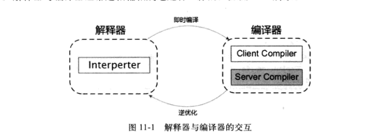
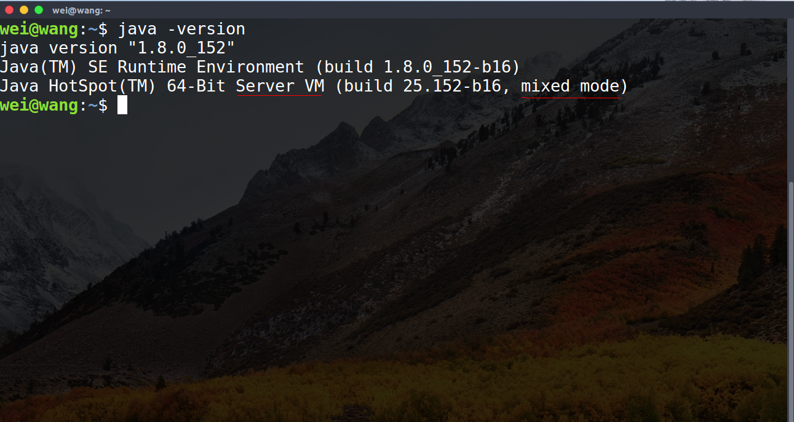

## 晚期(运行期)优化（Sun HotSpot）
### 引入“即时编译器”
部分的商用虚拟机（Sun HotSpot,IBM J9）中，Java程序最初是通过解释器进行解释执行的，当虚拟机发现某个方法或代码块的运行特别频繁时，就会把这些代码认定为"热点代码"。为了提高热点代码的执行效率，在运行时，虚拟机会将这些代码编译成与本地平台相关的机器码，并且进行各种层次的优化，完成这个任务的编译器称为即时编译器（Just In Time Compiler,即JIT编译器）
+ 即时编译器并不是JVM规范，而是由具体的虚拟机自己实现的
### 回答如下问题列表
1. 为什么HotSpot虚拟机要使用解释器和编译器并存的架构
2. 为什么HotSpot虚拟机要实现两个不同的即时编译器
3. 程序何时使用解释器执行？何时使用编译器执行？
4. 哪些程序代码会被编译为本地代码？如何编译为本地代码？
5. 如何从外部观察即时编译器的编译过程和编译结果？
### 解释器&&编译器
#### 解释器优势
1. 当程序需要迅速启动和执行的时候，解释器可以首先发挥作用，省去编译时间，立即执行
2. 当程序运行环境内存资源限制较大，可以使用解释执行节约内存，反之可以使用编译执行来提升效率。
3. 作为编译器**激进优化**的逃生门，当激进优化的假设不成立，出现**罕见陷阱**时可以通过逆优化退回到解释执行继续执行。部分没有解释器的虚拟机也会采用不进行激进优化的C1编译器担任逃生门。
#### 编译器优势
1. 在程序运行后，随着时间的推移，编译器逐渐发挥作用，将越来越多的代码编译为本地代码之后，可以获得更高的执行效率。
#### 解释器和编译器的交互
+ 在整个虚拟机执行架构中，解释器和编译器经常配合工作
    
#### HotSpot中的即时编译器
HotSpot虚拟机内置了两个即时编译器，分别称为Client Compiler (C1)和 Servier Compiler(C2)，在JDK1.7 及之前的版本，默认采用解释器与其中一个编译器直接配合的方式工作，程序使用哪一个编译器，取决于虚拟机的运行的模式，HotSpot虚拟机会根据自身版本与宿主机器的硬件性能自动选择运行模式，用户也可以使用**-client**或者**-server**参数强制执行虚拟机运行在Client模式还是Server模式
1. HotSpot内置两种编译器
2. HotSpot会依据自身版本&宿主机硬件性能自动选择运行模式。
3. 可以手动选择运行模式
##### 编译器和解释器搭配的模式
+ 混合模式:解释器和编译器搭配使用的方式
+ 编译模式:使用参数-Xcomp 强制虚拟机运行于编译模式，这时候将优先采用编译方式执行程序，但是解释器仍然要在编译无法进行的情况下介入执行过程
   - 解释器会介入执行，在编译无法进行的情况下
+ 解释模式:使用参数-Cint强制虚拟机运行于解释模式，这是编译器不会介入工作，全部的代码都使用解释执行
+ 
+  如上图，可以看出该jvm运行于server模式，且是使用混合模式运行
##### 解释器为编译器铺垫
1. 由于即时编译器编译本地代码需要占用程序运行时间，要编译出优化程度更高的代码，所花费的时间可能更长;并且，要想编译出优化程度更高的代码，解释器可能还要替编译器收集性能监控信息，这对解释器执行的速度也会有影响。
2. 为了在程序启动响应速度与运行效率之间达到最佳的平衡，HotSpot虚拟机会逐渐启用分层编译的策略。分层策略最终在JDK1.7的Server模式虚拟机中作为默认编译策略被开启。分层编译根据编译器编译、优化规模、耗时划分除了不同的编译层次
    + 第0层:程序解释执行，解释器不开启性能监控功能，可触发第一层编译
    + 第1层:也成为C1编译，将字节码编译为本地代码，进行简单、可靠的优化，如有必要将加入性能监控的逻辑
    + 第2层:也成为C2编译，也是将字节码编译为本地代码，但是会启用一些编译耗时较长的优化，甚至会根据性能监控信息进行一些不可靠的激进优化，不再承担收集性能监控信息的任务
3. 实施分层编译后，Client Compiler & Server Compiler会同时工作，许多代码都可能会被多次编译。用Client Compiler获取更高的编译速度，用Server Compiler来获取更高的编译质量，在解释执行的时候也无需再承担收集性能监控信息的任务