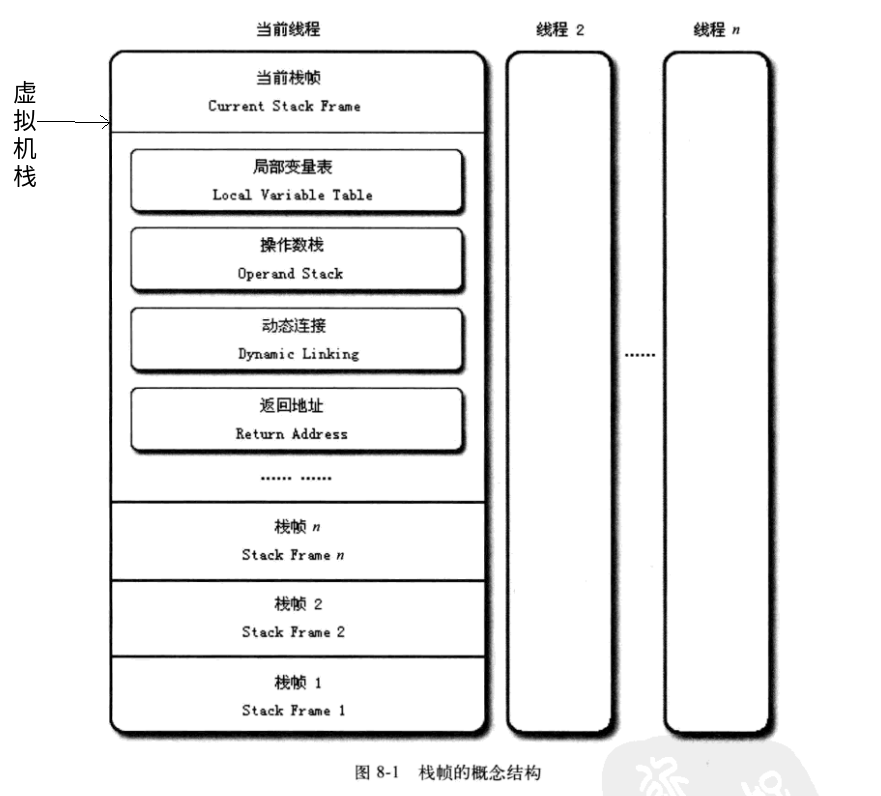

# 虚拟机字节码执行引擎
## 标准规范与自定义实现
1. 在Java虚拟机规范中制定了虚拟机字节码执行引擎的概念模型，这个概念模型成为各种虚拟机执行引擎的同一外观
2. Java虚拟机执行引擎输入的都是字节码文件，处理过程是字节码解析的等效过程，输出的是执行结果
   - 在不同的虚拟机中，执行引擎在执行java代码的时候可能会有解释执行和编译执行两种选择，也有可能两种都具备
## 运行时栈帧结构
### 虚拟机栈的元素 - 栈帧
栈帧(stack frame)是用于支持虚拟机进行**方法调用和方法执行**的数据结构，他是虚拟机运行时数据区中的虚拟机栈的栈元素
  + 栈帧与方法执行有什么联系？压栈？
#### 栈帧包含哪些内容
1. 局部变量表
2. 操作数栈
3. 动态连接
4. 返回地址
#### 什么是当前栈帧&当前方法
+ 背景：一个线程中的方法调用链可能很长，很多方法都同时处于执行状态。对于执行引擎来说，在活动线程中，只有位于栈顶的栈帧才是有效的，成为当前栈帧。与这个栈帧相关联的方法就是当前方法。**执行引擎所有的字节码指令都只针对于当前的栈帧进行操作**
   - 执行引擎所有的字节码指令都只针对于当前的栈帧进行操作
+ 虚拟机栈&栈帧的关系结构
<div></div>

### 局部变量表 
+ 作用：存放方法参数、方法内定义的局部变量
+ 基本单位:slot
   - JVM没有明确定义一个slot应该占用的内存空间的大小。只是说明每个slot都应该能够存放以下8种类型
      1. boolean
      2. byte
      3. char
      4. short
      5. int
      6. float
      7. reference
          表示对一个对象实例的引用，虚拟机并没有说明他的长度，也没有明确该是什么结构。但是通过这个引用该做到两点
            + 从引用中直接或者间接地查找到对象在堆中存放的起始地址索引（**找到实例**）
            + 从引用中直接或者间接地查找到对象所属数据类型在方法区中的存储的类型信息(**找到Class**)
      8. returnAddress
          指向一条字节码指令的地址
+ long和double的非原子协定
  将一次long/double类型的数据的读写分隔成两次32位读写
+ 访问方式
  - 虚拟机通过索引定位的方式使用局部变量表，索引值从0开始至局部变量表最大的slot数量。
     1. 若访问的是32位(一个slot表示)数据类型的变量，索引n就代表了使用第n个slot
     2. 若访问的是64位类型的变量，则说明会同时使用n和n+1两个slot。（jvm不允许使用任何方式单独访问其中的某一个slot）
+ **使用局部变量表完成参数值到参数变量列表的传递过程**
   - 若执行的是实例方法，那么局部变量表中第0位索引的slot默认是用于传递方法所属对象的实例的引用,在方法中可以使用关键字this来方法到这个隐含的参数。其余参数则按照参数列表顺序排序，占用从1开始的局部变量slot，参数表分配完成后，再根据方法体内部定义的变量顺序和作用域分配其余的slot
      + this（静态方法无此步骤）
      + 显示参数列表
      + 方法体内的局部变量
+ slot 是可以重用的
  - 基于这一点，在生成字节码文件的时候，方法的slot数量就已经确定了(见字节码文件方法表的code属性的max_locals的属性)
  - 为了尽可能节省栈空间，局部变量表中的slot是可以重用的。方法体中定义的变量，他的作用域并不一定会覆盖整个方法体。若当前字节码PC计数器的值已经超过了某个变量的作用域，那这个变量对应的slot就可以交由其他的变量使用
  - slot重用对垃圾收集的影响
      + 代码1
     ```java
     public class Demo{

      public static void main(String[] args){
         {
            byte[] placeHolder = new byte[64*1024*1024];
         }

         System.gc();
      }
     }
     //java -verbose:gc Demo
     //[GC (System.gc())  66805K->65960K(121856K), 0.0013052 secs]
    // [Full GC (System.gc())  65960K->65844K(121856K), 0.0043806 secs]
    // 可以看出，placeHodler并没有被回收
     ```
      + 代码2
      ```java
      public class Demo{

         public static void main(String[] args){
            {
               byte[] placeHolder = new byte[64*1024*1024];
            }

            int a = 0;

            System.gc();
         }
      }
      // java -verbose:gc Demo 
      //[GC (System.gc())  66805K->65896K(121856K), 0.0014384 secs]
      //[Full GC (System.gc())  65896K->308K(121856K), 0.0039774 secs]
      // 可以看出，placeHolder的内存被回收了
      ```
      + 为什么？
         - 第一次没有回收，是因为布局变量表中还存有关于placeHolder数据对象的引用(换句话说，能够通过GC Root找到placeHolder，这种关联没有打断)。虽然离开了placeHolder的作用域
         - 可以使用placeHolder = null;来代替int a = 0;(解释执行时有效)
   + 如何将垃圾回收与slot重用结合起来?
      - 又涉及到**“公有设计，私有实现”**
         + 共有设计：使用赋null值的操作来优化内存回收是建立在对字节码执行引擎概念模型的理解之上的。在虚拟机解释执行的时候，通常与概念模型比较接近。
         + 私有设计：通过JIT之后，是虚拟机执行代码的主要方式。赋null值在经过JIT编译优化之后被清除掉，所以此时赋null值没有任何意义。字节码被编译为本地代码之后，代码1的placeHolder在调用System.gc之后就会被回收掉。
      - 最好的方式是什么?
         + **以恰当的变量作用域来控制变量回收时间**。关键点：控制变量的作用域
   + 为什么Java变量一定要赋值才能使用[猜想]
      - 猜想:不想和C语言一样，不赋值就是给一个随机值，导致程序的错误。
           + 类变量，成员变量赋值，JVM帮忙做了
           + 局部变量赋值，只能手动做，为了性能
### 操作数栈
也称为操作栈，是一个后入先出的栈。
+ 栈的最大深度
   - 同局部变量表的slot数量一样，操作数栈的最大深度也在编译的时候写入到Code属性的max_stacks数据项中。在方法执行的任何时候，操作数栈的最大深度都不会超过max_stacks数据项中设定的值
+ 操作数栈的元素
   - 操作数栈的每一个元素可以是任意的java数据类型，包括long和double。32位数据类型所占的栈容量是1,64为数据类型所占的栈容量是2.
+ 操作数栈的使用
   - 当一个方法开始执行的时候，这个方法的操作数栈是空的，在方法执行的过程中，会有各种字节码指令往操作数栈写入和提取内容，这也就是出栈/入栈操作。
   - 例如：整数加法的字节码指令iadd在运行的时候操作数栈中最接近栈顶的两个元素已经存入了两个int类型的数值，当执行这个指令的时候，会将这两个int类型的值出栈并且相加，然后再将相加的结果存入栈。(字节码指令操作的是栈顶元素)
+ 字节码指令和操作数栈
   - 操作数栈中的元素类型必须与字节码指令的序列严格匹配，在编译程序代码的时候，编译器要严格保证这一点，在类校验阶段的数据流分析中还需要验证这一点。
      + 以iadd指令为例，他在执行的时候，最接近栈顶的两个元素的数据类型必须是int，不能出现一个long和一个float使用iadd命令相加的情况
+ 操作数栈的优化
   即令两个栈帧出现一部分重叠，为的是在方法调用的时候就可以共用一部分数据，无须进行额外的参数复制传递
+ JVM的解释执行是基于栈的执行引擎
  - 这里所指的栈是 操作数栈。如上所举的iadd指令(参数是最接近操作数栈顶的元素（出栈），结果又放入栈顶（入栈），以便于给其他字节码指令使用)